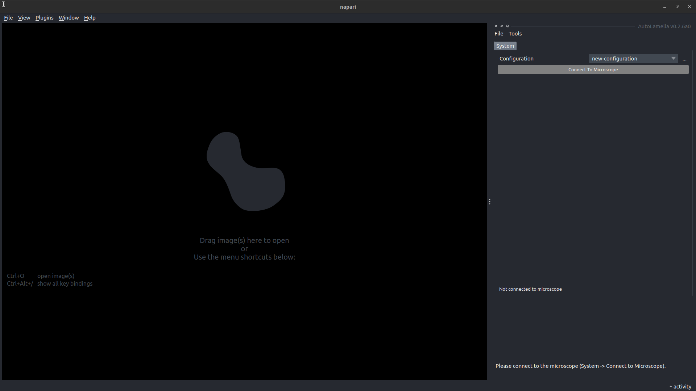
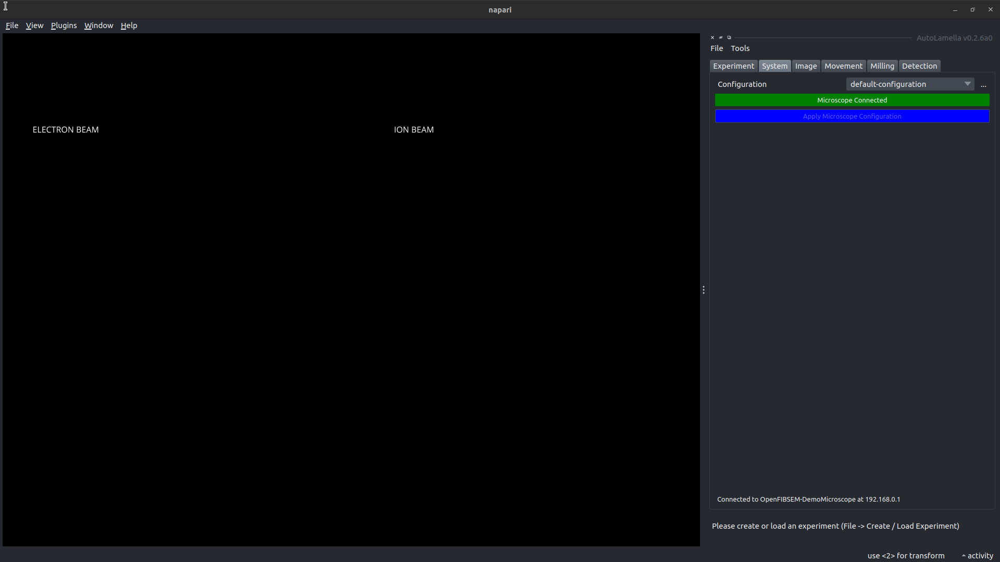
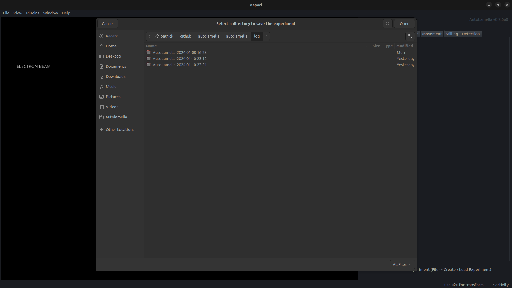
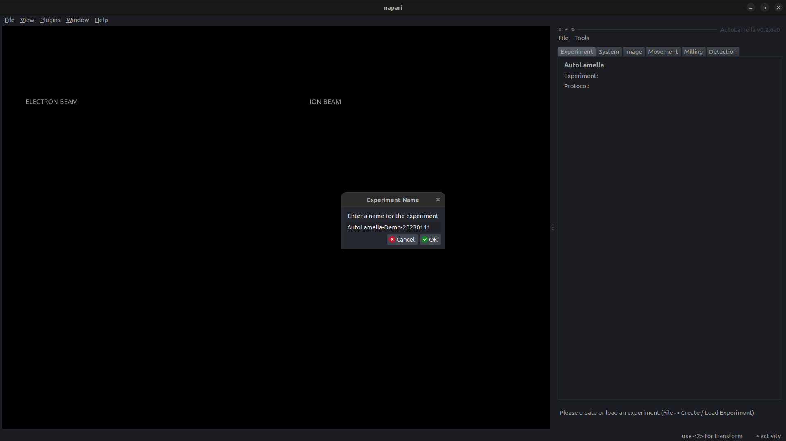
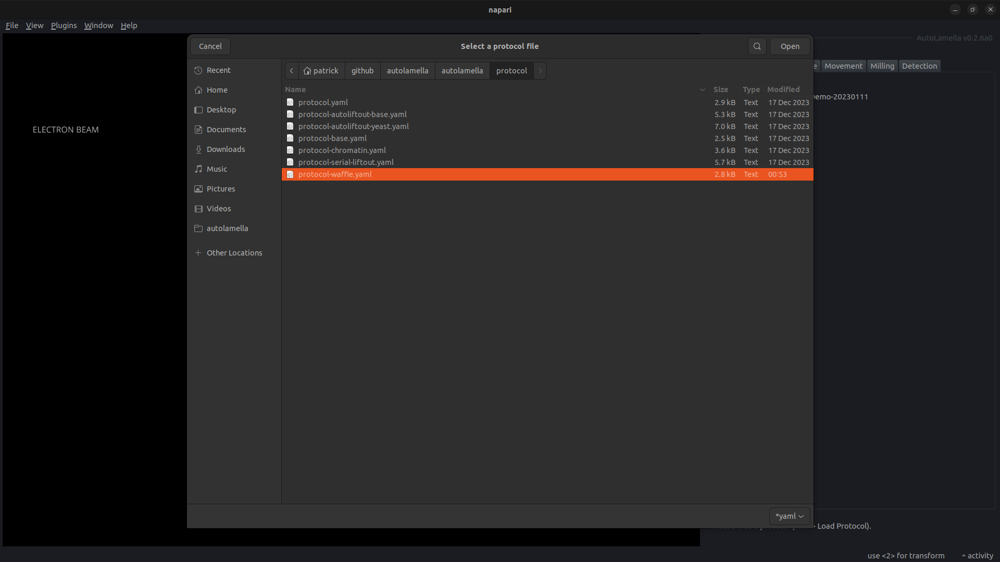
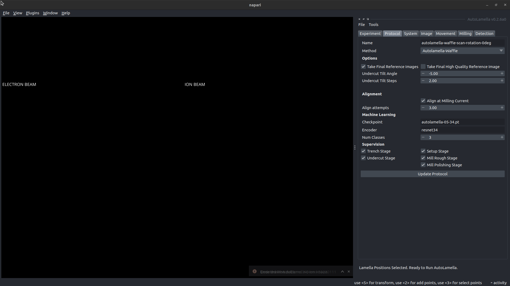
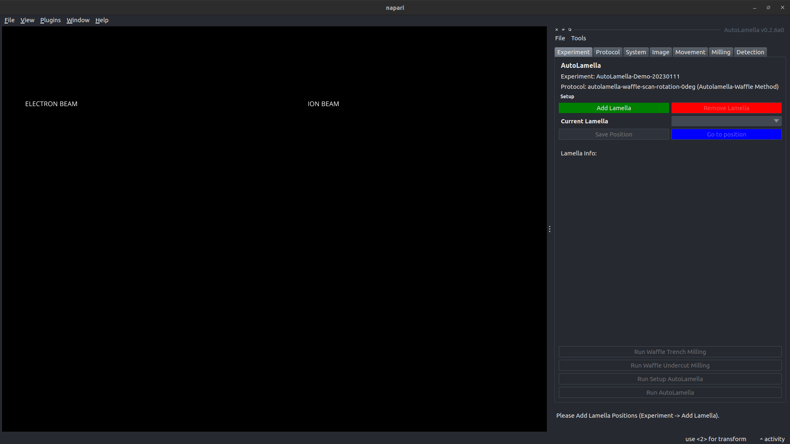
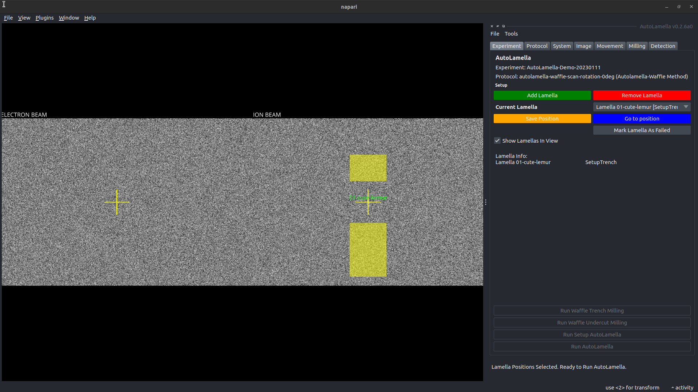
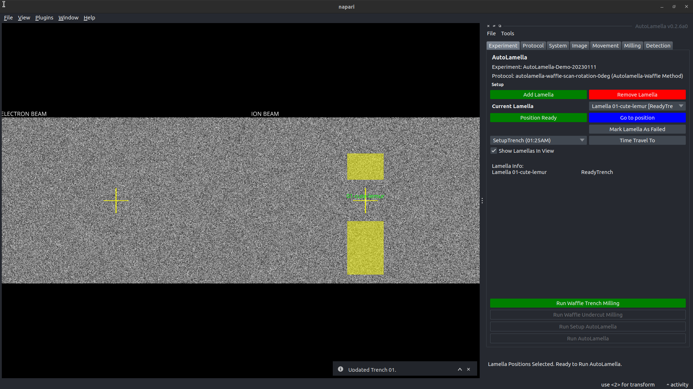

# Getting Started

## Installation

To install autolamella:

```bash
conda create -n fibsem python=3.9 pip
conda activate fibsem
pip install autolamella
```

This will also install the openfibsem dependency.

Alternatively, installing the napari plugin with pip or through the napari plugin manager, will install autolamella.

```bash
pip install napari-openfibsem
```

## Microscope Configuration

Please see the OpenFIBSEM API [Getting Started](../openfibsem/getting_started.md) for details about configuring your microscope.

## Protocols

The protocol file defines everything about the workflow. This includes the method, machine learning parameters, workflow options, and the milling configurations.

We provide individual baseline protocols for each method:

- autolamella-default: protocol-base.yaml
- autolamella-waffle: protocol-waffle.yaml
- autolamella-autoliftout: protocol-autoliftout-base.yaml
- autolamella-serial-liftout: protocol-serial-liftout.yaml

For details about the protocol options, please see below. For details about milling configurations, please see the [Milling API](../openfibsem/concepts.md#milling-api).

Protocol Structure

```yaml
# protocol
core:
    name: autolamella-waffle-mouse-scan-rotation-0deg                   # descriptive name of the protocol
    method: autolamella-waffle                                          # protocol method (see supported methods)
    ml-checkpoint: autolamella-05-34.pt                                 # machine learning checkpoint to use (see supported models)
options:
    alignment_attempts: 3.0                                             # the max number alignment repeat attempts
    alignment_at_milling_current: true                                  # whether to align at the milling or imaging current
    take_final_reference_images: true                                   # acquire reference images after final polishing
    take_final_high_quality_reference_images: false                     # acquire high quality (frame-integrated) images after final polishing
    take_final_overview_image: true                                     # acquire a low-magnification overview after final polishing
    compucentric_x_offset: 0.0e-6                                       # the fixed offset in x to apply after compucentric rotation 
    compucentric_y_offset: 0.0e-6                                       # the fixed offset in y to apply after compucentric rotation
    supervise:                                                          # enable supervision mode for indvidual stages
    supervise:
        landing: true
        liftout: true
        reset: true
        trench: true
        undercut: true
        setup_lamella: true
        mill_rough: true
        mill_regular: true
        mill_polishing: true
    batch_mode: true                                                    # batch trenching stages together
    confirm_next_stage: true                                            # confirm with the user before advancing to next stage
    complete_undercut: False                                            # complete the undercut stage
    return_to_eb_after_undercut: True                                   # return flat to electron beam after undercut
    liftout_joining_method: None                                        # method to join the manipulator and lamella (autolamella-autoliftout only) [None, Weld]
    liftout_contact_detection: True                                     # use brightness based contact detection (autolamella-autoliftout only)
    liftout_contact_offset: 0.25e-6                                     # additional offset movement after contact (autolamella-autoliftout only)
    liftout_charge_neutralisation_iterations: 35                        # number of ion images to charge sample (autolamella-autoliftout-only)
    landing_joining_method: Weld                                        # method to join lamella and landing post (autolamella-autoliftout only) [Weld]
    landing_post_x_offset: 0.75e-6                                      # additional offset movement after contact (autolamella-autoliftout only)
    landing_charge_neutralisation_iterations: 100                       # number of electron images to discharge sample (autolamella-autoliftout only)
    lamella_start_position: grid-01-lamella                             # the saved position to start selecting lamella positions 
    landing_start_position: grid-02-landing                             # the saved position to start selecting landing positions
    landing_grid:                                                       # the landing grid parameters (autolamella-serial-liftout only)
        x: 100.0e-6
        y: 400.0e-6
        rows: 4
        cols: 10
platinum:                                                               # platinum deposition parameters (optional)
    application_file: cryo_Pt_dep
    beam_current: 5.0e-11
    dwell_time: 1.0e-06
    gas: Pt dep
    position: Electron Default
    rate: 3.0e-10
    spot_size: 3.0e-06
    weld:
        hfw: 0.0001
        length: 1.5e-05
        time: 30.0
    whole_grid:
        hfw: 3.0e-05
        length: 7.0e-06
        time: 30.0
# milling                                                               # milling protocols for each stage (required for method)
notch:                                                                  # notch (autolamella-waffle)
    application_file: autolamella
    cleaning_cross_section: false
    depth: 2.5e-06
    distance: 2.0e-06
    enabled: true
    flip: 0
    hfw: 80e-6
    hheight: 2.0e-07
    hwidth: 4.0e-06
    milling_current: 2.0e-09
    preset: 30 keV; 2.5 nA
    vheight: 2.0e-06
    vwidth: 2.0e-07
    type: WaffleNotch
trench:                                                                 # trench: (autolamella-waffle, autolamella-autoliftout, autolamella-serial-liftout)
    application_file: autolamella
    cleaning_cross_section: false
    depth: 1.25e-06
    hfw: 0.00018
    lamella_height: 2.5e-05
    lamella_width: 2.2e-05
    milling_current: 7.6e-09
    offset: 0.0
    preset: 30 keV; 2.5 nA
    size_ratio: 2.0
    trench_height: 3.2e-05
    type: Trench
undercut:                                                               # undercut: (autolamella-waffle, autolamella-autoliftout, autolamella-serial-liftout)
    application_file: autolamella
    cleaning_cross_section: false
    depth: 1.2e-06
    height: 16.0e-06
    hfw: 8.0e-05
    milling_current: 7.6e-09
    preset: 30 keV; 2.5 nA
    tilt_angle: -5.0
    tilt_angle_step: 2.0
    width: 22.0e-6
    type: Rectangle
fiducial:                                                               # fiducial: (all)
    application_file: autolamella
    cleaning_cross_section: false
    depth: 1.5e-06
    enabled: true
    height: 1.0e-05
    hfw: 8.0e-05
    milling_current: 7.6e-09
    passes: null
    preset: 30 keV; 20 nA
    rotation: 45
    width: 1.0e-06
    type: Fiducial
lamella:                                                                # lamella: (all)
    stages:
    -   application_file: autolamella
        cleaning_cross_section: true
        depth: 2.0e-06
        hfw: 8.0e-05
        lamella_height: 5.0e-07
        lamella_width: 14.0e-6
        milling_current: 2.0e-09
        offset: 2.0e-06
        preset: 30 keV; 2.5 nA
        size_ratio: 1.0
        trench_height: 5.0e-06
        type: Trench
    -   application_file: autolamella
        cleaning_cross_section: true
        depth: 1.0e-06
        hfw: 8.0e-05
        lamella_height: 5.0e-07
        lamella_width: 1.4e-05
        milling_current: 7.4e-10
        offset: 5.0e-07
        preset: 30 keV; 1 nA
        size_ratio: 1.0
        trench_height: 2.0e-06
        type: Trench
    -   application_file: autolamella
        cleaning_cross_section: true
        depth: 4.0e-07
        hfw: 8.0e-05
        lamella_height: 4.5e-07
        lamella_width: 1.4e-05
        milling_current: 6.0e-11
        offset: 0.0
        preset: 30 keV; 50 pA
        size_ratio: 1.0
        trench_height: 6.0e-07
        type: Trench
flatten:                                                                # flatten: (autolamella-autoliftout)
    cleaning_cross_section: 1.0
    depth: 1.0e-05
    height: 2.5e-05
    hfw: 8.0e-05
    milling_current: 2.8e-08
    rotation: 0.0
    scan_direction: LeftToRight
    width: 2.0e-06
    application_file: "autolamella"
    type: "Rectangle"
    preset: "30 keV; 20 nA"
liftout-sever:                                                          # liftout-sever: (autolamella-serial-liftout)
    cleaning_cross_section: 0.0
    depth: 25.0e-06
    height: 5.0e-06
    hfw: 400.0e-6
    milling_current: 28.0e-09
    rotation: 0.0
    scan_direction: TopToBottom
    width: 50.0e-06
    application_file: "autolamella"
    type: "Rectangle"
    preset: "30 keV; 20 nA"
liftout-weld:                                                           # liftout-weld: (autolamella-serial-liftout)
    height: 5.0e-6
    width: 0.5e-6
    depth: 5.0e-6
    distance: 2.0e-6
    number: 5
    rotation: 0.0
    passes: 1.0
    milling_current: 0.74e-09
    hfw: 150.0e-6
    application_file: "autolamella"
    scan_direction: "TopToBottom"
    type: "SpotWeldVertical"
    preset: "30 keV; 2.5 nA"
prepare-copper-block-weld:                                                           # prepare-copper-block-weld: (autolamella-serial-liftout)
    height: 5.0e-6
    width: 0.5e-6
    depth: 5.0e-6
    distance: 2.0e-6
    number: 5
    rotation: 0.0
    passes: 1.0
    milling_current: 0.74e-09
    hfw: 150.0e-6
    application_file: "autolamella"
    scan_direction: "TopToBottom"
    type: "SpotWeldVertical"
    preset: "30 keV; 2.5 nA"
weld:                                                                   # weld: (autolamella-autoliftout, autolamella-serial-liftout)
    stages:
    -   height: 0.5e-6
        width: 5.0e-6
        depth: 5.0e-6
        distance: 2.0e-6
        number: 5
        rotation: 0.0
        passes: 1.0
        milling_current: 0.74e-09
        hfw: 150.0e-6
        application_file: "autolamella"
        scan_direction: "RightToLeft"
        type: "SpotWeld"
        preset: "30 keV; 2.5 nA"
    -   height: 0.5e-6
        width: 5.0e-6
        depth: 5.0e-6
        distance: 2.0e-6
        number: 5
        rotation: 0.0
        passes: 1.0
        milling_current: 0.74e-09
        hfw: 150.0e-6
        application_file: "autolamella"
        scan_direction: "LeftToRight"
        type: "SpotWeld"
        preset: "30 keV; 2.5 nA"
landing-sever:                                                          # landing-sever: (autolamella-serial-liftout)
    cleaning_cross_section: 0.0
    depth: 25.0e-06
    height: 1.0e-06
    hfw: 150.0e-6
    milling_current: 7.6e-09
    rotation: 0.0
    scan_direction: TopToBottom
    width: 50.0e-06
    application_file: "autolamella"
    type: "Rectangle"
    preset: "30 keV; 20 nA"
```

## Running AutoLamella

Once you have configured your microscope, and have a protocol selected, you are ready to run AutoLamella.

To run autolamella:

```bash

autolamella_ui
```

### User Guide


AutoLamella - Start Screen


AutoLamella - Microscope Connected


AutoLamella - Create Experiment


AutoLamella - Name Experiment


AutoLamella - Select Protocol


AutoLamella - Protocol UI


AutoLamella - Ready to Start


AutoLamella - Add Lamella


AutoLamella - Trench Ready
