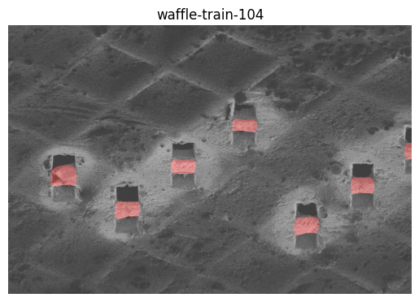
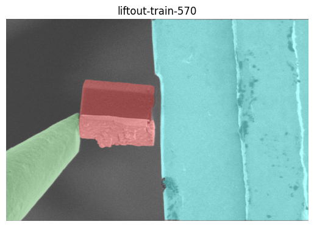
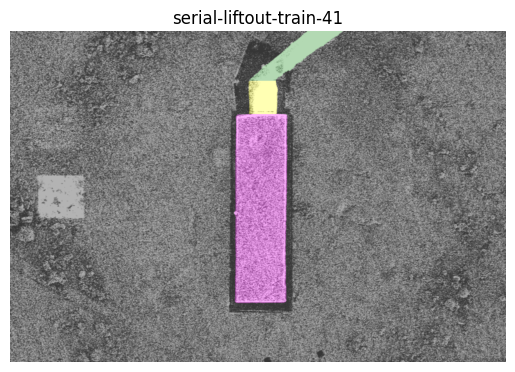
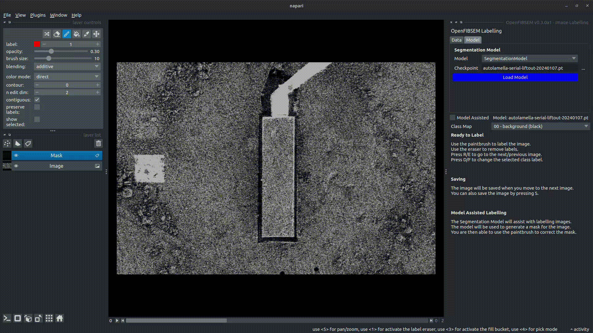

# Machine Learning

Machine Learning is a core part of AutoLamella. Here we are highlighting the datasets, models and tooling we have developed as part of the project.

## Dataset

### AutoLamella Dataset

The autolamella dataset consists of images from multiple different lamella preparation methods. All data is annotated for semantic segmentation, and is available through the huggingface api at [patrickcleeve/autolamella](https://huggingface.co/datasets/patrickcleeve/autolamella)

Summary

| Dataset / Method      | Train    |   Test   |  Total |
| ----------- | ----------- | -----------| -----------|
| Waffle      |    214    |  76   | 290 |
| Liftout |   801      | 163 | 969 |
| Serial Liftout |   301      | 109             |  412 |
| **Full** | **1316** | **348** | **1664** |


Details about the datasets can be found in summary.csv in the dataset directory.

### Labels

Currently, the dataset is labelled for the following classes. In the future, we will add additional labels for objects such as ice contamination. If you would like to label this data, please see the labelling tools to get started.

```yaml
CLASS_LABELS: # autolamella
  0: "background"
  1: "lamella"
  2: "manipulator"
  3: "landing_post"
  4: "copper_adaptor"
  5: "volume_block"
```


#### Downloading Data

To download datasets, you can use the huggingface api:

```python

from datasets import load_dataset

# download waffle dataset
ds = load_dataset("patrickcleeve/autolamella", name="waffle")

# download liftout dataset
ds = load_dataset("patrickcleeve/autolamella", name="liftout")

# download serial-liftout dataset
ds = load_dataset("patrickcleeve/autolamella", name="serial-liftout")

# download test split only
ds = load_dataset("patrickcleeve/autolamella", name="waffle", split="test")

```

To display images and annotations:

```python
# show random image image and annotation (training split) 
import random
import numpy as np
import matplotlib.pyplot as plt
from fibsem.segmentation.utils import decode_segmap_v2

# random data
idx = random.randint(0, len(ds["train"]))
image = np.asarray(ds["train"][idx]["image"])
mask = np.asarray(ds["train"][idx]["annotation"])

# metadata
split = ds["train"].split
config_name = ds["train"].config_name

plt.title(f"{config_name}-{split}-{idx:02d}")
plt.imshow(image, cmap="gray", alpha=0.7)
plt.imshow(decode_segmap_v2(mask), alpha=0.3)
plt.axis("off")
plt.show()

```

| Waffle     | Liftout    |   Serial Liftout   |
| ----------- | ----------- | ----------- |
|     |      |    |


### Acknowledgement

- Waffle and Liftout data from Monash
- Serial Liftout data from MPI


### Dataset Format

Image data is 8bit grayscale tiffs, labels are saved as class index maps (8bit tiff). The corresponding image and labels have the same filename, and the labels are located in the labels/ directory.

The file layout of the dataset is:

```bash
autolamella-dataset/
    summary.csv
    autolamella-waffle/
        train/
            image-0000.tif
            labels/
                image-0000.tif
        test/
    autoliftout/
    serial-liftout/
```

### Keypoint Dataset

The keypoint dataset is used for model evaluation, to as closely mimic the online performance of the models when running on an actual FIBSEM.

[Under Construction]

## Models

## Baseline Models

We have trained models for each method on the subset of data. Models are available on huggingface patrickcleeve/openfibsem-baseline. Includes archived development models. You can try out a demo of these models on [huggingface](https://huggingface.co/spaces/patrickcleeve/autolamella-demo).

The current best performing models for each method are:

| Method       | Dataset | Checkpoint   |
| ----------- | ----------- | -----------|
| AutoLamella Waffle      | Waffle       | autolamella-waffle-20240107.pt    |
| AutoLamella Liftout | Full        | autolamella-mega-20240107.pt  |
| AutoLamella Serial Liftout | Serial Liftout         | autolamella-serial-liftout-20240107.pt               |

### Mega Model

We are in the process of developing a combined model for all these methods, called the mega model.

Currently the mega model is outperformed by the specifc waffle, and serial liftout models, but performs better for liftout. My initial thought is that this is because the waffle and serial liftout datasets are from a single sample (and a single run in the serial liftout case), so on these cases the models are probably overfit on these modes. However, the liftout dataset contains multiple samples, and a much more diverse set of images, which benefits more increased size and variation in the dataset.

Therefore, we are very keen to incorporate a lot more varied training data for the other methods. We are looking for additional data to include in this model, if you would like to contribute, please get in contact.

## Tools

This section highlights some of the tools developed.

For specific details about concepts and terminology, please refer to the [Concepts Page](../openfibsem/concepts.md).

### Data Collection and Curation (Supervised Mode)

When running autolamella, imaging data is logged and saved for later use. When running in supervised mode, every correction the user makes is logged and classified. We use this user feedback to automatically split the dataset, and generate a set of evaluation keypoints for testing. This form of active learning allows efficient model improvement by only including data that the model fails to predict correctly.

### Data Labelling (Model Assisted Labelling)

We developed a napari plugin for labelling images for semantic segmentation. The plugins supports manual labelling and model assisted labelling.

Model assisted labelling supports two kinds of model; segmentation models and segment anything models. Segmentation models allow prelabelling of data using a pretrained segmentation model, while segment anything models use a generic segment anything model to prompt segmentation. The user can then manually edit the segmentation to correct for any model errors.

In practice these two models are useful at different stages of development. For example, when labelling a new dataset, or one where the model performance is poor, using segment anything allows you to quickly generate segmentation masks with interactive prompting. Once you have a decent model, segmentation model labelling is much faster, and usually only requires minor edits from the user.

#### Example: Serial Liftout Data

When we received the serial liftout data, we didnt have any models trained for it. Therefore, it was much faster to use SAM to label the training dataset. Once an initial model was trained we switched to using the segmentation model, and manually editing the masks.


Segment Anything Labelling


Model Assisted Labelling

With the assistance of this tooling, the full dataset (all methods) now contains around 1600 labelled images.

### Model Evaluation

We provide evaluation tools for evaluating the perform of a number of different models on the keypoint detection task.

The evaluation will run each model checkpoint through the detection pipeline, save the results and compare them to the ground truth labels provided. Each individual image can be plotted, as well as the full evaluation statistics. This evaluation pipeline is useful for checking model improvement and preventing regressions on previously successful tasks.

Here we are showing evaluations from the development models.

[Under Constrution]

## Experimental

### Generating Labels

From the segmentation masks, you can generate other useful labelled objects. The following script will generate bounding boxes and instance segmentations for each object in the mask.

Generate bounding boxes and instance masks from segmentation masks.
generate_segmentation_objects.py

These should be easily converted to coco-format for training.

[Under Construction]
