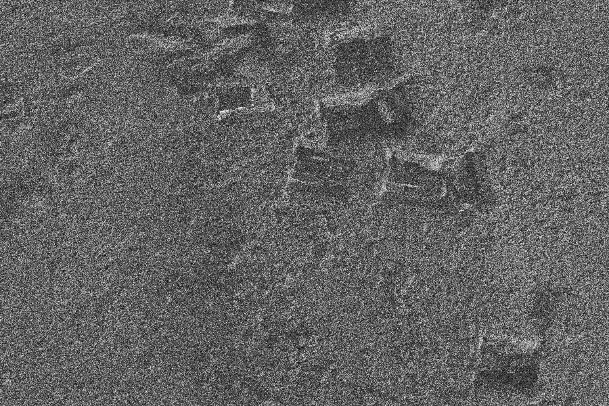
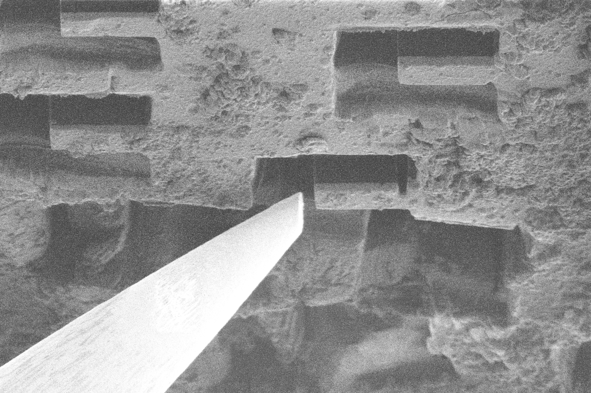
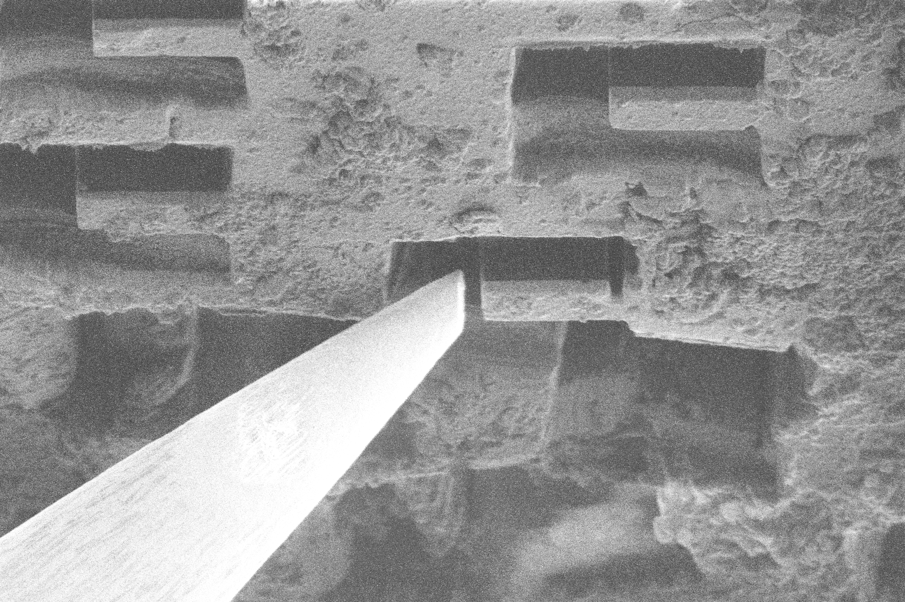
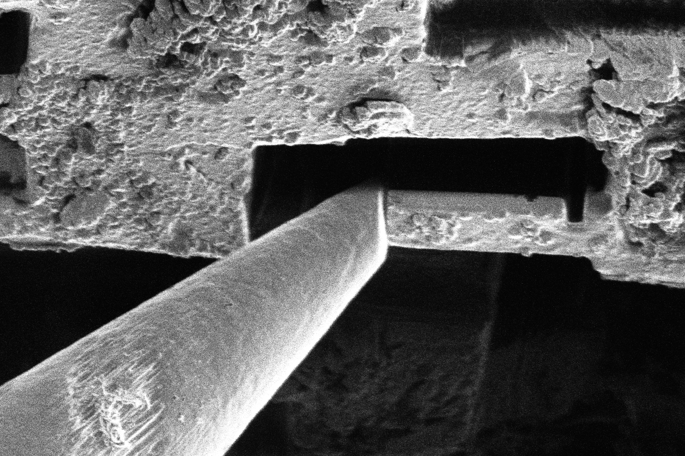
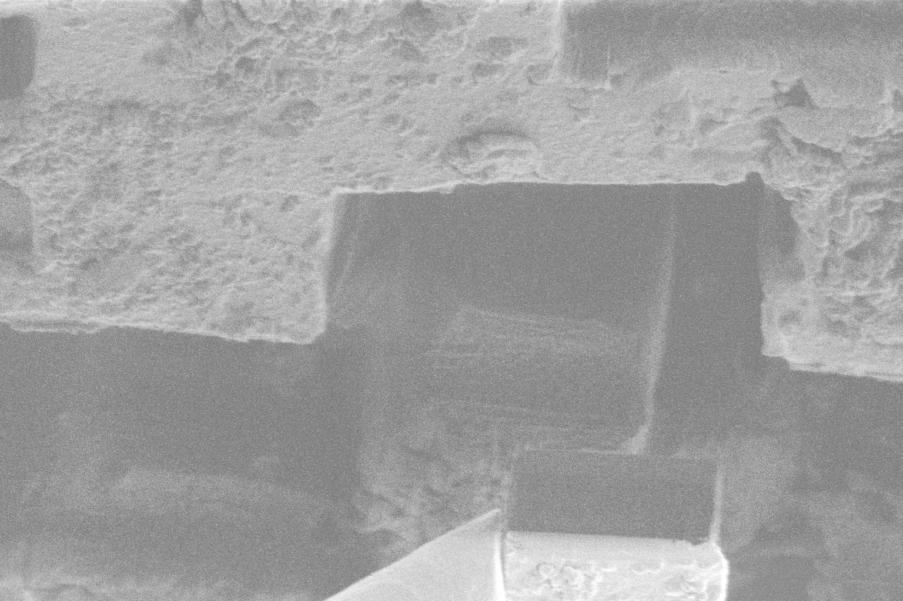
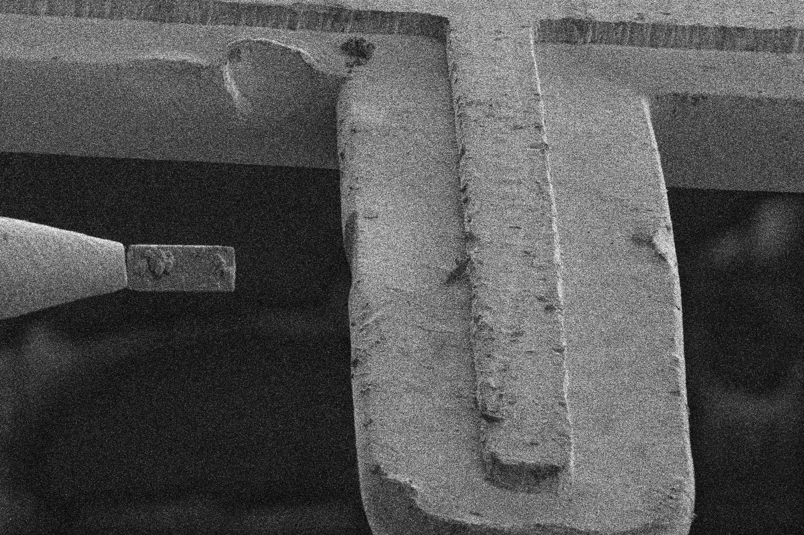
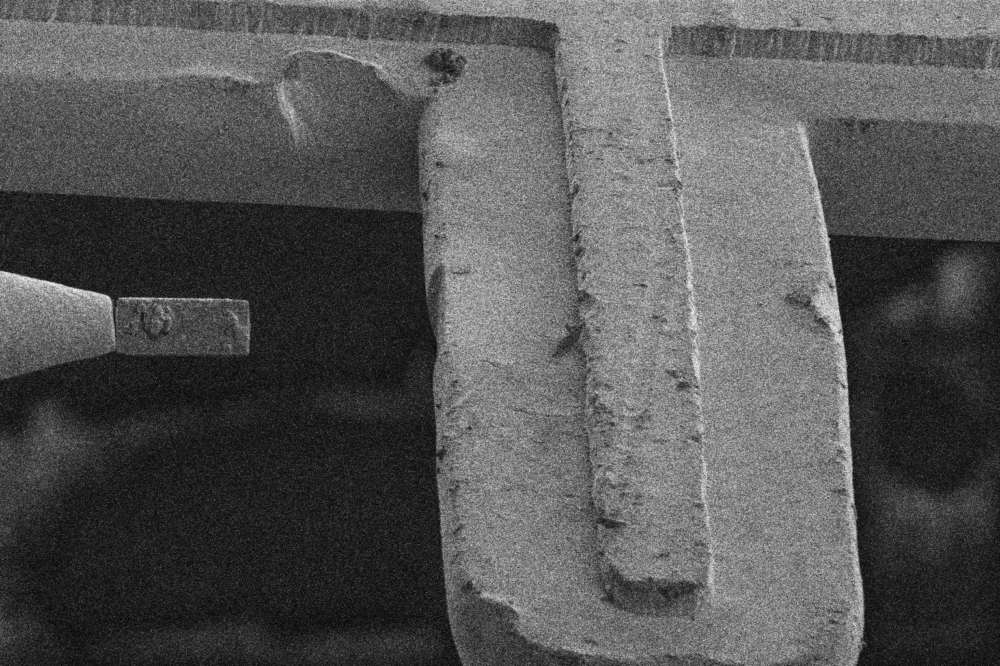
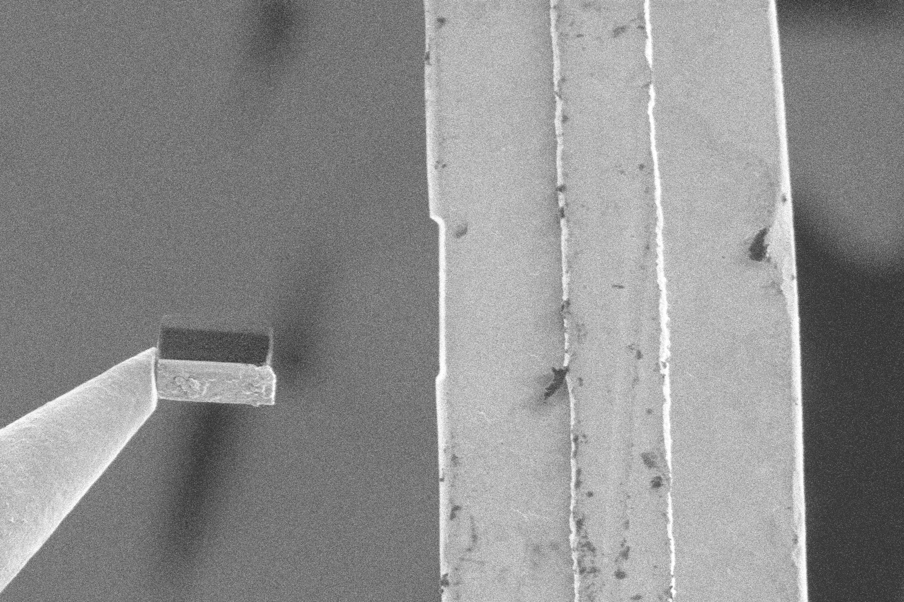
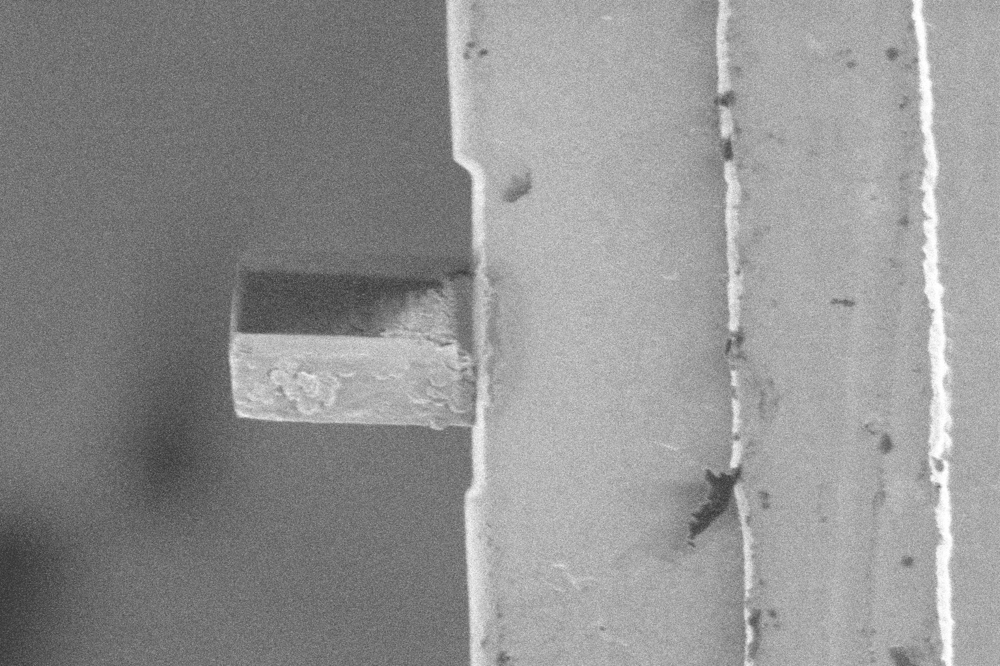

# Workflow

AutoLamella workflows are broken down into a series of consecutive steps called workflow stages. Workflow stages are shared across methods, with most only requiring changes to the protocol. 

We group these stages into three conceptual groups; setup, isolation and polishing.  

The full map of every workflow is as follows:

[TODO]

## Workflow Stages

At the end of each workflow stage, we save the state of the microscope, allowing us to restore the state of the microscope at the start of the next stage,This allows us to continue on exactly from the previous state even if time has passed, the system has been rebooted or any other interruption. It also allows us to batch operations, e.g. perform all trench milling operations together, and easily stop and start the program.  

Assume that at the end of every workflow stage, the state is saved and can be restored to via the time travel controls.

Pre Workflow Stage:
We restore the state of the microscope which was saved after selecting positions, and log that this workflow stage has started for analytics purposes.  

Post Workflow Stage:  
We save the state of the microscope, and log that this workflow stage has finished.  

## Setup

In the setup stages, the user selects the positions for milling and landing (liftout methods only). These stages are currently manual, and the user must select the position by following the guided steps in the workflow.

### Select Positions

The user selects the milling positions. For the on-grid method these are the positions of the final lamella and are selected at the milling angle. For waffle, liftout and serial-liftout the positions are for trench milling and are selected flat to the ion beam. 

On-grid and waffle methods support the use of the minimap, which allows multiple positions to be selected in a short amount of time, as well as correlation with fluorescence data. We will add minimap support for other methods in the future. 

For liftout methods, the user needs to specify the inital lamella and landing positions in the protocol. Saved positions can be exported from the Movement tab, and are stored in fibsem/config/positions.yaml.  

```yaml
options:
    trench_start_position: pre-tilt-35-deg-grid-01-lamella     # starting point for selecting milling position
    landing_start_position: pre-tilt-35-deg-grid-02-landing     # starting point for selecting landing position
```

### Select Landing Positions

The user selects the landing positions for liftout methods. For the liftout method the user is required to select a landing position for each selected milling position. For serial-liftout, we generate a map of landing positions, based on the protocol values.

```yaml
options:
    landing_grid:
        x: 100.0e-6     # grid spacing in x
        y: 400.0e-6     # grid spacing in y
        rows: 4         # number of rows to generate
        cols: 10        # number of columns to generate
```

## Isolation

The isolation stages remove the bulk of material from the sides and underside of the selected area. Higher milling currents are used to prioritise material removal over sample damage. 

### Trench Milling

The trench milling stage removes the bulk of material from around the selected area.

#### Restore Selected Position

We restore the selected trench milling position that was selected the setup steps. The trench milling position was selected flat to the ion beam, so we do not need to move. Both the position of the stage, and the milling pattern were selected.

##### Align Reference Image

We can optionally choose to align a reference image to re-align with more precision. (Not recommended).

##### Mill Trench

We retrieve the milling pattern and position from the protocol and draw it. If in supervised mode, the user has the opportunity to edit this pattern. Otherwise, the milling operation will start. Once milling has finished, the system is restored back to the imaging configuration.

#### Acquire Reference Images

We acquire low and high magnification reference images. These enable us to analyse the success of the milling operations, and provide a potential reference for alignment in future alignments.

### Undercut Milling

The undercut milling stage removes material from the underside of the selected area, freeing it from the base of the sample / holder. 

#### Restore Trench Milling Position

We restore the trench milling position.

#### Move Flat to Electron Beam

We move the stage flat to the electron beam (rotate 180 degrees compucentrically).

You can specify an additional compucentric rotation offset with the following parameters:

```yaml

options:
    compucentric_x_offset: 25e-6    # fixed y movement after compucentric rotation (metres)
    compuncentric_y_offset: 50e-6   # fixed y movement after compucentric rotation (metres)
```

#### Coincident Feature Alignment

We perform a coincident feature alignment to ensure we are coincident after compucentrically rotating.

Align Feature Coincident
    Detect Feature Centre in Electron Beam
    Stable Move to Feature Centre
    Detect Feature Centre in Ion Beam
    Vertical Move to Feature Centre
    The Feature should now be centred in both beams (coincident)

We can specify which feature we want to align with using the features argument.

```yaml
on-grid: null
waffle: LamellaCentre
liftout: LamellaCentre
serial-liftout: VolumeBlockTopEdge
```

Under the hood we use the projected stage position to differentiate between multiple feature detection. The position is projected from the trench milling position to this view.  

#### Mill Undercut

We tilt the stage down (negative) to access the underside of the volume block. We can perform this step in increments by specifying the parameters, tilt_angle, and tilt_angle_step. Specifying multiple steps will repeat this step multiple times, gradually shrinking the height of the undercut pattern.

We detect the top edge of the volume block to place our undercut pattern. We can specify a specific offset from this pattern to determine how 'deep' we want to perform the undercut, v_offset.

```yaml
undercut:
    ...
    tilt_angle: -5      # undercut tilt per step
    tilt_angle_step: 2  # number of undercut steps
    v_offset: 5.0e-6    # milling pattern offset
```

We retrieve the undercut milling pattern from the protocol and draw it using the detected feature position. Once milling operations are completed the microscope is restore back to the imaging configuration.

#### Return Flat to Electron Beam [Optional]

After milling the undercut pattern, we can optionally return flat to the electron beam, or stay at the tilted angle. It's recommended to stay at the tilted angle if doing the waffle method as the next step is to perform the lamella thinning and polishing.

```yaml
options:
    undercut_return_to_electron: true   # move flat to electron after undercut
```

#### Align Feature in Ion Beam

After moving back we align the feature in the ion beam to ensure coincidence of the beams before moving to the next stage.

#### Acquire Reference Images 

We acquire low and high magnification reference images for analysis and alignment.

### Liftout

The liftout stage attaches the selected region to the manipulator, and severs it from the rest of the sample. After liftout, the selected region should be solely attached to the manipulator and be ready to be transfered to the landing grid.  

Specific implementations for liftout, and serial-liftout. 

#### Restore Undercut Position

We restore to the undercut position. 

#### Coincident Feature Alignment

We use the coincident alignment (LamellaCentre) procedure to ensure the beams are coincident.

#### Insert Manipulator

We insert the manipulator to the liftout offset position. This position is just above the eucentric position, and to the left of the sample. 

#### Manipulator Control

We use the feature detector to move the manipulator to the left edge of the lamella. The feature detection detects the manipulator tip, and the lamella left edge in both beams, and moves the manipulator into position inside the side trench to the left of the lamella edge. If deposition free attachment is used, the sample is charged at this point.  

#### Manipulator Contact and Attachment

Once the manipulator is positioned to the left edge of the lamella and inside the trench, we horizontally towards the lamella, so the manipulator makes contact with the side of the lamella. If brightness based contact detection is used, the manipulator will move slowly towards the lamella until a brightness change is observed.

Once the manipulator is in contact with the lamella, the joining method can occur. For deposition free attachment, the workflow continues. For redeposition welding, the 
weld pattern if placed at the interface of the manipulator and lamella. The lamella and manipulator are now joined together. 

```yaml
options
    liftout_joining_method: null                    # manipulator joing method to use, None or Weld
    liftout_contact_offset: 0.25e-6                 # additional movement after contact
    liftout_contact_detection:                      # use brightness based contact detection
    liftout_charge_neutralisation_iterations: 35    # number of images to charge sample before contact
```

#### Manipulator Sever

We detect the right edge of the lamella region, and place the severing pattern. The severing pattern dettaches the lamella from the rest of the sample. The lamella should be attached solely to the manipulator. 

#### Retract Manipulator
The manipulator is moved slowly upwards from the trench, and then retracted fully. 

### Landing

The landing stage attaches the selected region to the landing grid, and severs it from the manipulator. After landing the selected region should be solely attached to the landing grid, and dettached from the manipulator. 

Specific implementations for liftout, and serial-liftout.


### Restore Landing Position

We restore the landing position selected by the user, and align to the reference images. We should be centred on the landing position and coincident in both beams.

### Insert Manipulator

We insert the manipulator to the landing position, which is near the parking position high above the grid. We detect the lamella, manipulator and landing position and move the manipulator down to the left of the landing post position. 

### Landing Procedure
We detect the right edge of the lamella and the landing post and move the manipulator so they are in contact. 

Once they are in contact we can weld the lamella to the landing post. The reposition weld pattern (spot_weld) is placed on the landing post side of the interface between the lamella and landing post. If the manipulator and lamella were welded togehter, they are cut using a milling pattern. 

The manipulator is slowly pulled back from the landing post, and reference images are acquired. If the lamella has been successfuly attached to the post, the workflow continues. If deposition free attachment was used, and the lamella fails to attach to the landing post it will still be attached to the manipulator, and the landing procedure can be repeated again. 

### Retract Manipulator
We retract the manipulator, and acquire high and low magnification reference images for analysis and alignment. If the manipulator needs to be reset due to being cut, the reset procedure occurs now. 

## Polishing

The polishing stages mill the final lamella to electron transparency. In these stages, lower milling currents are used to prioritise sample damage over material removal.  

### Setup Lamella

Prior to polishing we get the user to select the final polishing position and pattern. The user also can confirm the position of an alignment fiducial, specified in 'fiducial'. This allows the user to avoid contamination, or use fluroescence data to correlate milling sites, which are not currently supported.

This is a guided workflow, and the stage will move to the position of the last completed stage (waffle: undercut, liftout: landing), so the user only needs to move the pattern in the user interface. Once the user selects the polishing position, the microscope state is saved.  

### Mill Stress Relief

We mill a stress relief feature for on-grid methods to prevent lamellae from cracking when polished. The feature to mill is defined using the following key:

```yaml
on-grid: microexpansion 
waffle: notch
```

Practically, this milling operation occurs at the same time as the thinning cut to save time.  

### Mill Thinning Cut

The thinning cut removes the bulk of the material from the lamella, but leaves a small amount to prevent contamination on the final polished lamella. Contamination will slowly build up on all exposed surfaces, so we want to complete all the polishing as close to finishing the workflow and removing the sample as possible.  

#### Align Reference Image

We restore the microscope state from the setup lamella stage, and align to the fiducial image. The user can specify the following alignment parameters. 

```yaml
options:
    alignment_attempts: 3               # the number of alignment repeats
    alignment_at_milling_current: true  # align at the milling current (or imaging current)
```
#### Mill Thinning Pattern

We retrieve the lamella milling pattern from the protocol, and the position selected in the setup lamella stage. We mill all lamella stages, excluding the final one which is completed during the polishing stage. The following protocol shows an example of the breakdown.  

```yaml
lamella:
  stages:
    -   application_file: autolamella   # mill thinning
        ...         
        trench_height: 3.5e-06
    -   application_file: autolamella   # mill thinning
        ...
        trench_height: 2.0e-06
    -   application_file: autolamella   # mill polishing
        ...
        trench_height: 5.0e-07
```
Once the milling is complete, the microscope returns to the imaging configuration. 

#### Acquire Reference Images

We acquire low and high magnification reference images for analysis and alignment.

### Mill Polishing Cut

The final polishing should be completed as close to removing the sample from the microscope as possible to prevent contamination build up. 

#### Align Reference Image

We align the fiducial reference image the same as in the thinning stage. 

#### Mill Polishing Pattern
We retrieve the final polishing pattern and position from the protocol and mill the pattern. Once the milling is complete, the microscope returns to the imaging configuration. 

#### Acquire Reference Images

We acquire low and high magnification reference images for analysis and alignment. Additional high quality images (frame integrated) can be specified for this stage. The final reference images can also be disabled

```yaml
options:
    take_final_reference_images: true               # take reference images after polishing
    high_quality_image: 
    enabled: true                                   # take high quality reference images after polishing


```

## Methods Implementation

### On Grid Method

### Waffle Method

### Liftout Method

AutoLamella Liftout is an automated liftout method for the preparation of cryo lamella.
The autoliftout requires the following workflow steps:

#### Setup

- The user selects lamella and landing positions.

| Description |Electron Beam            |  Ion Beam
:-------------------------:|:-------------------------:|:-------------------------:
| Lamella Position (Low) | |  
| Lamella Position (High) |  |  
| Landing Position (Low) |  |  
| Landing Position (High) |  |  


#### Mill Trench

Mill lower, upper and side trenches using high currents. (horsheshoe pattern, see ref)

- Lower and Upper trenches release lamella from the bulk.
- Side trench provides access for the needle.

|Description| Electron Beam            |  Ion Beam
:-------------------------:|:-------------------------:|:-------------------------:
| Trench Position (Low)  |  |  
|Trench Position (High)  | |  

#### Mill Undercut

- Mill the underside and part of the other side of the lamella to release from the base of the bulk. Undercut is also refered to as the jcut.

|Description| Electron Beam            |  Ion Beam
:-------------------------:|:-------------------------:|:-------------------------:
| Undercut Position (Low)  |  |  
|Undercut Position (High)  | |  


#### Liftout

1. Insert the needle, and guide to near the lamella.
2. Charge the sample with the ion beam
3. Make contact with the lamella,
4. Sever the lamella from the bulk.
5. Retract the needle.

| Description |Electron Beam            |  Ion Beam
:-------------------------:|:-------------------------:|:-------------------------:
| Liftout Entry Position | |  
| Liftout Ready Position | |  
| Liftout Contact Position | |  
| Liftout Sever Position | |  
| Liftout Retract Position | |  

#### Landing

1. Insert the needle, and guide the lamella to the post
2. Weld lamella to the post
3. Discharge the lamella with the electron beam
4. Removal the needle from the lamella
5. Retract the needle

| Description |Electron Beam            |  Ion Beam
:-------------------------:|:-------------------------:|:-------------------------:
| Landing Entry Position 0 | |  
| Landing Entry Position 1 | |  
| Landing Entry Position 2 | |  
| Landing Entry Position 3 | |  
| Landing Ready Position | |  
| Landing Weld Position | |  
| Landing Removal Position | |  
| Landing Retract Position | |  

#### Setup Lamella

- The user selects the regions of the lamella to polish

|Description| Electron Beam            |  Ion Beam
:-------------------------:|:-------------------------:|:-------------------------:
| Polish Setup Position (Low)  |  |  
|Polish Setup Position (High)  | |  
|Polish Setup Position (Ultra)  | |  

#### Mill Thinning

- Thin the lamella to a lower thickness, using a relatively high current.

|Description| Electron Beam            |  Ion Beam
:-------------------------:|:-------------------------:|:-------------------------:
| MillRoughCut Position (Low)  |  |  
|MillRoughCut Position (High)  | |  
|MillRoughCut Position (Ultra)  | |  

#### Mill Polishing 

- Polish the lamella to electron transparent thickness.
- Should be completed immediately prior to transfer to prevent contamination buildup.

|Description| Electron Beam            |  Ion Beam
:-------------------------:|:-------------------------:|:-------------------------:
| MillPolishingCut Position (Low)  |  |  
|MillPolishingCut Position (High)  | |  
|MillPolishingCut Position (Ultra)  | |  


The following methods were developed for the liftout workflow.

#### Manipulator Preparation

We flatten the side of the needle to maximise surface contact area with the side of the lamella.

TODO: images

#### Landing Surface Preparation

We flatten the side of the landing post to maximise surface contact area with the side of the lamella.
TODO: images

#### Charge Control

Biological samples in cryogenic conditions often have large amounts of charge which causes challenges with imaging. Often this charging saturates the detectors and images either glow white or completely dark. To overcome this issue, we have developed the following techniques:

- AutoGamma: We automatically apply a digital gamma correction to the image if sufficient mean pixel intensity is determined. Gamma correction shifts the image histogram allowing features to be detected in the image (however it reduces image quality).
- Charge Neutralisation: To reduce the accumulated charge, we apply a charge neutralisation procedure (e.g. taking a rapid series of electron images to neutralise ion charge after large milling operations). This helps control the charge buildup throughout the process.

TODO: images

#### Side Pickup

To provide better landing stability, we liftout much larger lamella than typical. In conjunction with manipulator and landing surface preparation, we are able to make consistent, right-angled contact with a large surface area between the lamella and the landing post. This provides a more stable base from which to thin the lamella down. The downside of using this method is an increased material waste, and increased thinning time to remove excess material.

To provide better liftout, and landing stability we make contact with the side of the lamella to lift it out of the trench. The side pickup provides the following benefits:

- More stability on contact: we apply a compressive force to the side of the lamella, instead of bending (if touching from the top). This allows us to make firmer contact without bottoming out the lamella in the trench.
- Better orientation for landing: Due to the lack of rotation/tilt control the angle of liftout determines the orientation for landing the lamella. When lifting from the top of the lamella, it can sometimes rotate, roll or slide of the needle tip when making contact with the post causing bad landing orientation. It is analogous to spinning a basketball on your finger, it can be done but is difficult to repeat. Making contact from the side allows for the lamella to be evenly compressed between the needle and the post, maintaining its orientation.

#### Contact Detection

In order to determine whether the needle and lamella have made sufficient contact, we developed a contact detection procedure.

- We monitor the image brightness, whilst driving the needle towards the lamella.
- When contact is made between the needle and lamella, there is a significant increase in brightness due to charge disipation. This effect occurs due to the charge build up in the platinum crust being grounded when contact is made with the needle.
- We detect this change, and stop the needle movement.

Example 01 | Example 02  | Example 03 | Example 04 |
:-------------------------:|:-------------------------:|:-------------------------:|:-------------------------:
||||

However, this effect is very sample dependent and does not occur on some samples.


Sample Specific Contact Detection

#### Deposition Free Attachment

We have developed a repeatable procedure for lifting the lamella by only manipulating the charge buildup. This method does not rely on platinum deposition, or welding (redeposition).

- To attach: We move the needle and lamella close together, and take a series ion beam images to build up charge. When the lamella and needle make contact they stick together with static due to charge.
- To dettach: Once the lamella is welded to the landing post, we run the electron beam to disapate the charge, and the needle slides off the lamella.

The procedure is still being developed, and understood and is very sensitive to parameters and different conditions (e.g. the number of images being taken).

##### Liftout (Attach)

|Description |Ready|Contact | Sever  |
:-------------------------:|:-------------------------:|:-------------------------:|:-------------------------:|
|Electron View| ||  |
|Ion View | ||  |

##### Landing (Dettach)

|Description |Ready| Weld | Removal |
:-------------------------:|:-------------------------:|:-------------------------:|:-------------------------:|
|Electron View| | | 
|Ion View| |  | 


### Serial Liftout Method

## User Interface

## Process Improvements

### Machine Learning Microscope Control

### Contact Detection

### Deposition Free Manipulator Attachment

### Coincidence Alignment

### Instance Detection

## Experiment Management

### Microscope Configuration

### Protocol Configuration

### Analysis and Optimisation

