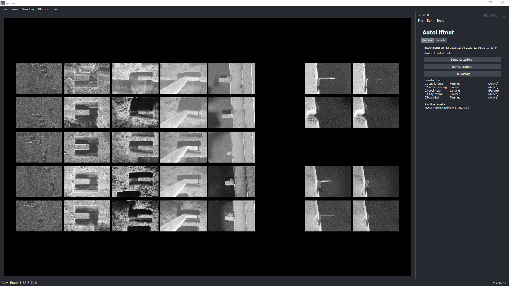
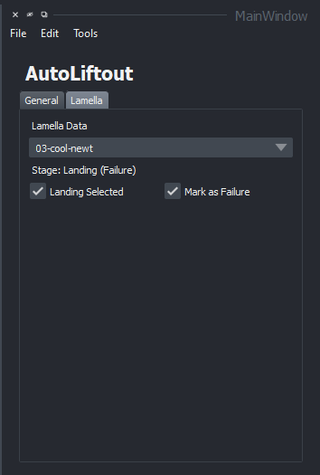

# Getting Started

To get started using AutoLiftout, you will need to install the program and prepare your microscope and sample.  Once you have done this, you can run the program.

## Installation

### Install Dependencies

Please see [OpenFIBSEM](https://github.com/demarcolab/fibsem) for how to install the dependencies.

### Install AutoLiftout Environment

Clone this repository: 

```
$ git clone https://github.com/DeMarcoLab/autoliftout.git
```

Install dependencies and package

```bash
$ cd autoliftout
$ conda env create -f environment.yml
$ conda activate autoliftout
$ pip install -e .

```

## Preparation

We used the following microscope and setup for AutoLiftout:

- Microscope: ThermoFisher Helios Hydra PFIB
- Sample: Drosophila Embryo on Carrier
- Landing Post: Ted Pella Posts (8)
- Shuttle: 35 Degree Pre-Tilt (Carrier + Autogrid slots)
- Manipulator: (TODO: needle brand)


### Preparing the Manipulator

Before starting autoliftout, you will need to prepare the manipulator:

- Mill the end of your manipulator so there is a 10um flat vertical surface. TODO: image @patrickcleeve2
- Perform EasyLift Alignment (Needle Calibration)


## Running the Program

To run autoliftout enter the following command in your terminal:

```bash
autoliftout_ui
```


(@patrickcleeve2 change this flow, it is weird. Should be something like:
Start -> New Experiment or Load Experiment -> Run Experiment)

2. Enter a name for your experiment (All experiments are saved in autoliftout/liftout/log)


To edit your protocol / settings before you start your experiment, click the Edit->Edit Protocol button. This will open the protocol editor. You can edit the protocol and save it by clicking the "Save" button. You can also load a previously saved protocol by clicking the File->Load Protocol button.


3. You can now start your experiment by clicking the "Setup AutoLiftout" button.


4. You will be guided through the setup process. Follow the instructions on the screen and click "Continue" when you are ready to move on. Setup consists of two steps:

- Selecting the lamella positions.
- Selecting the landing positions.

Once Setup is complete, the 'Run AutoLiftout' button will be enabled. Click this button to start autoliftout.

5. You will be guided through the run process. Follow the instructions on the screen and click "Continue" when you are ready to move on. The autoliftout workflow consists of the following stages:

- MillTrench: Lamella are milled to create a trench (Upper, Lower, Side Release).
- MillUndercut: Lamella are milled to create an undercut. (Underside Release)
- Liftout:  Lamella are lifted out of the trench using the manipulator.
- Landing:  Lamella are landed on the landing posts.
- Reset: Manipulator is sharpened and returned to the home position [Optional].

As these stages complete, the user interface will update to show the progress of the experiment.



You are able to add more lamella positions to your experiment by re-running the 'Setup AutoLiftout' button. This will allow you to add more lamella positions to your experiment. You can also change the lamella options by clicking the 'Lamella Tab'. This will allow you to lamella properties for the experiment. Lamellas marked as failed are not included in the experiment.




6. Once AutoLiftout is finished, the 'Run MillPolishingCut' button will be enabled. Click this button to start polishing. The MillPolishingCut workflow consists of the following stages:

- SetupPolish: User selects the region of the lamella to polish.
- MillRoughCut:  Lamella are thinned to removal bulk of material.
- MillPolishingCut: Lamella are polished to electron transparency

It is recommended that you run the polishing workflow after all lamella have been lifted. We have found this helps prevent contamination build-up. However, you can run the polishing workflow at any time.


7. You are able to view the statistics for the run by opening a new terminal and entering the following command:

```bash
cd autoliftout/liftout/tools
streamlit run stats.py
```

The following stats page will open up in a web browser. Enter the name of the experiment you would like to view, and the statistics should populate.


For a more detailed guide of the workflow, see the [User Guide](/docs/UserGuide.md) page.

## Troubleshooting

If you find any bugs or issues with the program, please create an issue on the [GitHub Issues](https://github.com/DeMarcoLab/autoliftout/issues) page. 