# Concepts

This page provides an overview of the OpenFIBSEM API and describes concepts and terminology used. 

The code examples on this page are provided in a notebook: [Github Repo](https://github.com/DeMarcoLab/openfibsem-docs/tree/main/notebooks)

## Microscope Connection

OpenFIBSEM uses a client-server model for connecting to the microscope. The best way to connect to the microscope it to use the setup_session utility. This will handle reading the configuration file, setting up logging and connecting to the microscope. 

It returns two items:

- microscope: the microscope connection  
- settings:   the microscope settings

The microscope connection is how we will communicate with the microscope, and will be passed to most funcitons. The microscope settings are a copy of the configuration settings, and contain the default imaging settings we will use in settings.image. 

```python

# connecting to the microscope
from fibsem import utils

# connect, setup session use default configuration
microscope, settings = utils.setup_session()

# specify a configuration path
microscope, settings = utils.setup_session(config_path="path/to/configuration.yaml")

```

### Microscope Configuration

Before we can connect to the microscope, there are a few values we need to configure the microscope, and connection.  For details about configuring your microscope, please see the [Getting Started Page](getting_started.md#configuring-your-microscope).


If you used setup_session, your configuration is stored in the microscope connection as:

```python
# microscope configuration
microscope.system
```

By default, the configuration is not automatically applied to the microscope to prevent accidently changing settings when connecting. To apply the specified configuration, use the following command.


Please not that this might take some time, for example if you have specified a plasma gas this can take 10 minutes to change to a different gas. 

```python

# apply current configuration
microscope.apply_configuration()

# or specify a new configuration
microscope.apply_configuration(settings.system)

```

## Turning on the System

It is recommended to setup the system manually (e.g. pump the system, turn on the beams, focus and link the stage), but we also provide an api to do this. You will need to turn on the beams, and pump before you can apply the configuration. 

```python

from fibsem.structures import BeamType

# pump the system
microscope.pump()

# turn on electron beam
microscope.turn_on(BeamType.ELECTRON)

# turn on ion beam 
microscope.turn_on(BeamType.ION)

# home the stage
microscope.home()

```

You change get / set these properties and more through the get / set api:

```python

# check if electron beam is on
electron_on = microscope.get("on", BeamType.ELECTRON)
print(f"Electron Beam: {electron_on}")


# check chamber state
chamber_state = microscope.get("chamber_state")
print(f"Chamber State: {chamber_state}")

# get column tilt of ion
ion_column_tilt = microscope.get("column_tilt", BeamType.ION)
print(f"Ion Column Tilt: {ion_column_tilt}")

```

```yaml
Electron Beam: True
Chamber State: Pumped
Ion Column Tilt: 52
```


## Imaging

The imaging api is the core of the openfibsem api. It provides access to image acquistion, imaging parameters and tools. We currently support Electron and Ion Beam imaging.

### Imaging Parameters

To control the imaging acquistion, we use the ImageSettings. The image settings you defined in configuration are attached to the microscope settings, for use and editing.


```python

# print the image settings
print(settings.image)


# change image settings
settings.image.dwell_time = 2e-6  # set the dwell time to 2us
settings.image.save = True        # automatically save the image (note: this overwrite existing data, check the filename!!)


```


```python

@dataclass
class ImageSettings:
    """A data class representing the settings for an image acquisition."""


    beam_type: BeamType = None
    resolution: list = None               # imaging resolution      (pixels)
    dwell_time: float = None              # imaging dwell time      (seconds)
    hfw: float = None                     # imaging field of view   (metres )
    autocontrast: bool = None             # use autocontrast method 
    autogamma: bool = None                # use autogamma method
    save: bool = None                     # save the image
    path: Path = None                     # the save path           (directory)
    filename: str = None                  # the save filename       (str)
    reduced_area: FibsemRectangle = None  # sub frame imaging coords       
    line_integration: int = None          # integrate scan line     [TFS Only]
    scan_interlacing: int = None          # scan interlacing        [TFS Only]
    frame_integration: int = None         # integrate frames        [TFS Only]
    drift_correction: bool = False        # req frame int           [TFS Only]

```

### Acquiring Images

To acquire images, we use the acquire module:

```python

from fibsem import acquire
from matplotlib.pyplot import plt

# acquire image
eb_image = acquire.acquire_image(microscope, settings.image)

# change settings, reacquire
settings.image.hfw = 400e-6             # set the hfov to 400um
settings.image.beam_type = BeamType.ION # set the imaging to ion beam
ib_image = acquire.acquire_image(microscope, settings.image)

# plot
fig, ax = plt.subplots(1, 2, figsize=(15, 7))
ax[0].imshow(eb_image.data, cmap="gray")
ax[0].set_title("Electron Beam")
ax[1].imshow(ib_image.data, cmap="gray")
ax[1].set_title("Ion Beam")
plt.show()


```

### Image Metadata (FibsemImage)

When acquiring images, we also snapshot the state of the microscope. The state is stored in the metadata and can be accessed:


```python
## Image Metadata
from pprint import pprint

# get the image settings used
image_settings = eb_image.metadata.image_settings
print(f"Image Settings: {image_settings}")

# access the stage position
stage_position = eb_image.metadata.microscope_state.stage_position
print(f"Stage Position: {stage_position}")

# get the electron detector used for imaging
detector = eb_image.metadata.microscope_state.electron_detector
print(f"Electron Detector: {detector}")

# pretty print the metadata (note: this is a lot of data)
pprint(eb_image.metadata.to_dict())

```

## Save / Load FibsemImage

You can save and load the images and metadata is retained. If you specify save=True in the imaging settings images will be automatically saved using the specified path and filename. Note: this save will automatically overwrite any existing image at that path/filename. Make sure you change this if you want to retain your data. 

```python
from fibsem.structures import FibsemImage

# save the image
path = "data/test_electron_image.tif"
eb_image.save(path)

# load the image
loaded_image = FibsemImage.load(path)
print(f"metadata: {loaded_image.metadata}")

# plot both
fig, ax = plt.subplots(1, 2, figsize=(15, 7))
ax[0].imshow(eb_image.data, cmap="gray")
ax[0].set_title("Original Image")
ax[1].imshow(loaded_image.data, cmap="gray")
ax[1].set_title("Loaded Image")
plt.show()
```

### Chamber Camera

You can acquire an image from the chamber camera:

```python

# acquire chamber image
image = microscope.acquire_chamber_image()

plt.imshow(image.data, cmap="gray")
plt.show()

```

## Stage Movement

The stage is the central movable system for the microscope, on which the sample is mounted. Most systems have 5 degrees of freedom (DoF); x, y, z, rotation, tilt. Some systems also have an additional tilt axis (roll axis, or tilt_beta).  

The sample is rigidly mounted onto the stage through the use of a sample holder (also called the shuttle), and the two move together. As far as I am aware, it is not possible to move the holder independently from the stage.

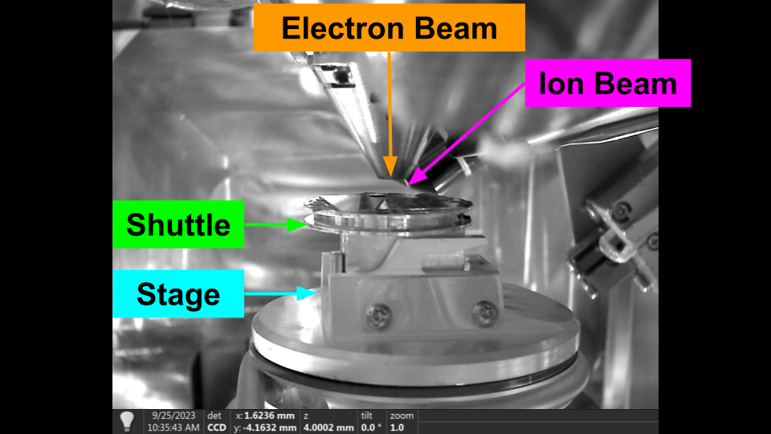
Stage Definitions

For cryo lamella preparation, the shuttle has a pre tilted face. This pre tilt is used to provide additional tilt than can be achieved by the stage alone. We will discuss the use of pre-tilted shuttles later. 


Pre-Tilted Shuttle

In general, we want to move along the sample plane (along the sample grid) while maintain coincidence between the beams. We also need to provide a method for correcting the coincidence, as it often drifts after large rotations etc. 

### Movement Concepts

The following sections describe some core concepts, and terminology we use for the movement api. It is important to understand these terms for the next section.

### Axes and Coordinate Systems

When describing the stage axes and positions, we always use a raw coordinate system. This is the raw position of the stage defined from a static reference position (by the manufacturer). We do not use the linked (specimen) coordinate on Thermo Fisher system, but in order to access some functionality the system needs to be linked. You do not need to unlink the system to access the raw coordinates, it can remain linked and the api specifies the coordinates are to be raw. 

Axes:

X+: Towards Door

Y+: Towards Load Position

Z+: UP

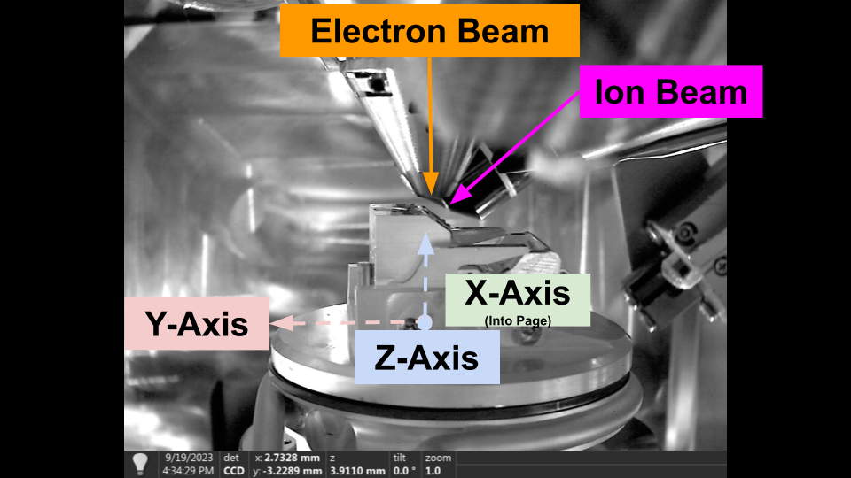
Stage Movement Axes - Thermo Fisher

Depending on the manufacturer, the default stage axes may  be attached to the stage, or fixed in the chamber. For Thermo Fisher systems, the stage axes are attached to the stage, i.e. y-axis and z-axis tilts with stage tilt, while for Tescan it is not. Therefore, to provide consistent movement between systems we provide our own movement functions. 

### Shuttle Pre-Tilt

The shuttle pre-tilt adds additional complexity to stage movement, as the sample plane is now tilted relative to the stage axes. The following diagram shows how shuttle pre-tilt changes the sample plane. 


Stage Flat with Pre-Tiled Shuttle


We provide compensation for moving along the sample plane, and maintaining beam coincidence through the stable_move api. 

#### Stage Positions

You can get and move to stage positions with the api. We also provide utils to save stage positions to file (.yaml) for restoration later. 

By default these stage positions are saved to fibsem/config/positions.yaml, and are accessible through the user interface (Movement Tab).

```python
# get stage position
stage_position = microscope.get_stage_position()


# go to stage position
microscope.safe_absolute_stage_movement(stage_position)

# save stage position (saves to fibsem/config/positions.yaml by default, can be specified)
stage_position.name = "my-position-01"
utils.save_positions(stage_position)

```

#### Flat to Beam

It is common to move the stage so that the sample surface is perpendicular to the imaging axis of one of the beams. When the stage is in one of these positions, we refer to it as being 'Flat to the Beam', e.g. Flat to the Electron Beam.

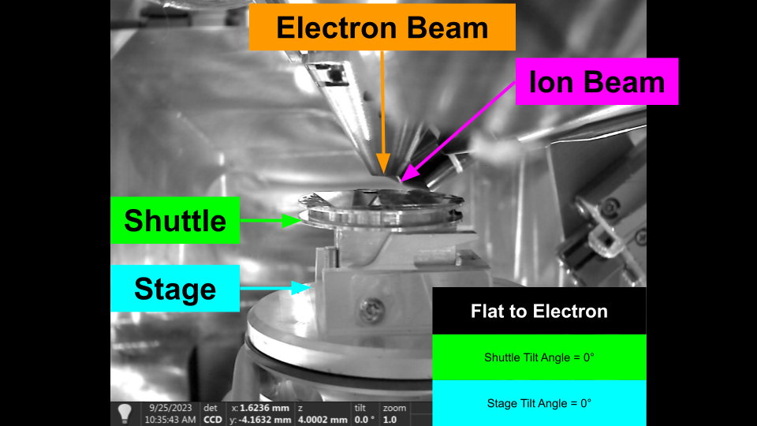
Flat to Electron - Flat Sample Holder

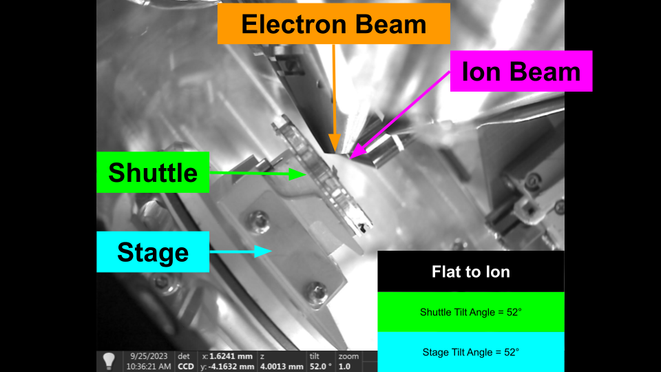
Flat to Ion - Flat Sample Holder

To move to these positions, we require some information which is defined in the configuration:

```yaml

stage:
  rotation_reference: 0         # the reference rotation (rotation when loading the stage usually)
  rotation_180:       180       # 180 degrees offset from rotation reference
  shuttle_pre_tilt:   45        # the pretilt of the shuttle
electron:
  column_tilt:        0         # the tilt of the electron column
ion:
  column_tilt:        52        # the tilt of the ion column

```

In order to move flat to the beam, we need to adjust for the pre-tilt and column tilts, and specify which rotation reference to use. By definition, the electron beam uses the rotation reference, and the ion beam use the rotation 180. These values aren't always 0 / 180 and are determined by how the stage is physically mounted in the system.

Once these values are defined we can easily move flat to the beam as follows:

```python

# NOTE: this will move from the current position, and only change rotation and tilt. It is recommended you move under the beam before hand.

# move flat to the electron
microscope.move_flat_to_beam(BeamType.ELECTRON)

# move flat to the ion
microscope.move_flat_to_beam(BeamType.ION)

```

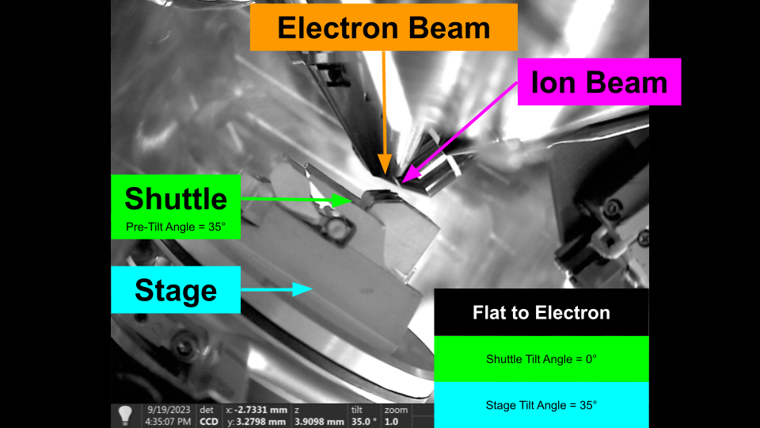
Flat to Electron - Shuttle Pre-Tilt


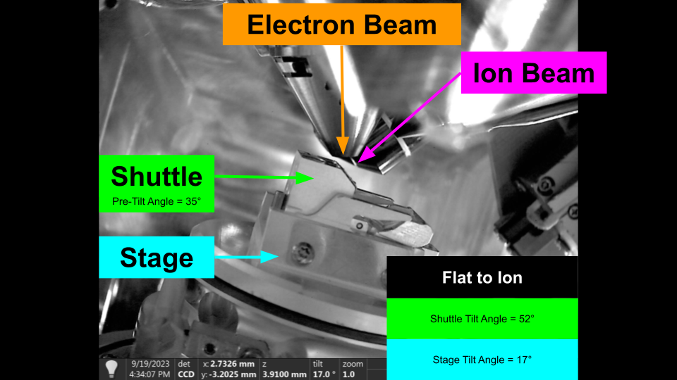
Flat to Ion - Shuttle Pre-Tilt


#### Beam Coincidence

Beam coincidence is defined as the positioning of the stage, such that both beams are centred on the same feature. We sometimes also discuss the eucentric position, which refers to being able to tilt the stage and have the feature stay centred in the image. 

We can easily find the coincidence point for the system by using the following algorithm:

1. Centre a Feature in the Electron Beam
2. Move the Stage vertically in the chamber, until the feature is also centred in the Ion Beam.

The system is now at the coincidence point.

The difficult part of the algorithm is two fold:

1. We need to detect the same feature in both beam. Detecting features automaticaly can be difficult, and their appearance can vary between beams due to imaging differences and perspective.

2. The standard stage axes move with the tilt of the stage, meaning it has to be compensated depending on the tilt, and pre-tilt.

We provide a number of methods and tools for resolving these issues, which will be discussed shortly. 

#### Microscope State

As described in the imaging section, we can snapshot the microscope state. This allows us to restore the state of the microscope at any point.

The state is defined as the stage position, and the beam and detector settings for both beams.

```python

@dataclass
class MicroscopeState:

    """Data Class representing the state of a microscope with various parameters."""

    timestamp: float                            # timestamp of state
    stage_position: FibsemStagePosition         # raw stage position
    electron_beam: BeamSettings                 # electron beam settings
    ion_beam: BeamSettings                      # ion beam settings
    electron_detector: FibsemDetectorSettings   # electron detector settings
    ion_detector: FibsemDetectorSettings        # ion detector settings


```

You can get and restore the state as follows:
```python

# store microscope state
state = microscope.get_microscope_state()

# restore microscope state
microscope.set_microscope_state(state)

```

#### Movement Axes and Types

We provide the following movement modes, and describe their application.

##### Relative Movement

A relative movement, moves the stage by the specified amount in the raw coordinate system. This movement uses the manufacturers definition of the coordinate system. For example, for Thermo Fisher systems this moves in axes attached to the stage position.

If you are using ashuttle pre-tilt it is recommended to use stable movement instead.

##### Absolute Movement

Absolute movement moves the stage to specified position in the raw coordinate system. It is used to return the stage to a previous position, or a projected position (based on a stable movement)

You can use absolute movements to return to previous positions with high accuracy. 

```python

# get the initial position
start_position = microscope.get_stage_position()

# relative move (dx=20e-6, y=20e-6)
stage_position = FibsemStagePosition(x=20e-6, y=20e-6)
microscope.move_stage_relative(stage_position)

# absolute move
microscope.safe_absolute_stage_movement(stage_position)


```

#### Stable Movement

Stable movements move the stage along the sample plane. The primary use of stable movement is maintaining coincidence as you move across the sample. Stable moves correct for the stage tilt, shuttle pre-tilt and imaging perspective, and therefore you specify a beam to calculate the perspective from. 

Once you find the coincidence point, you can use stable movements to move across the sample and maintain coincidence. This does degrade over larger distances, and we are working on making it more robust. 


```python

# NOTE: it recommended that you make the beams coincident before this to see the effect
# move flat to electron
microscope.move_flat_to_beam(BeamType.ELECTRON)

# stable move
microscope.stable_move(dx=20e-6, dy=20e-6, beam_type=BeamType.ELECTRON)


```

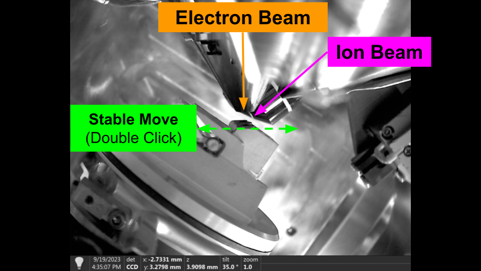
Stable Movement - Flat to Electron

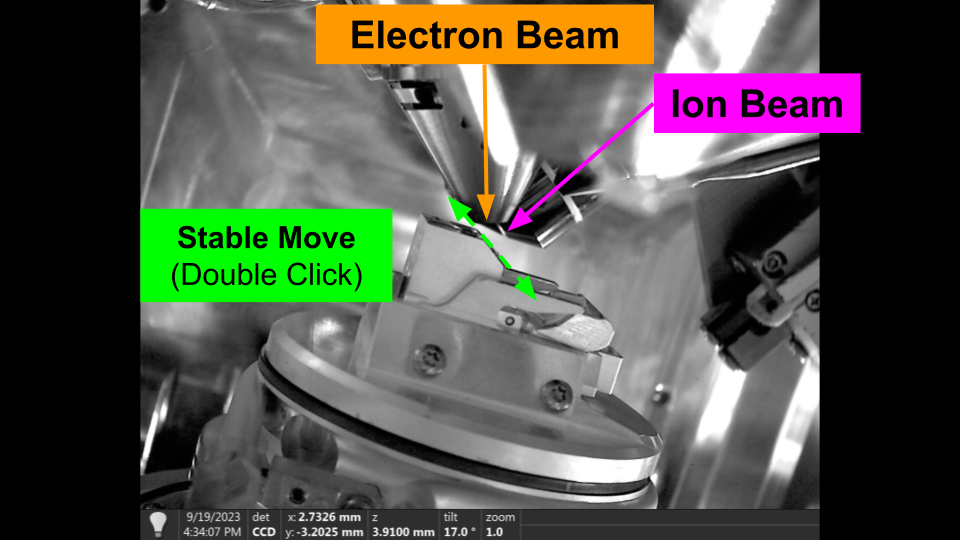
Stable Movement - Flat to Ion


#### Vertical Movement

Vertical movements, move the stage vertically in the chamber, regardles of tilt. The primary use of vertical movement is to restore coincidence of the beams. As a result, vertical movements can only be specified from the Ion beam perspective. 

You can use vertical movement in the user interface by holding 'Alt' and double clicking in the Ion Beam.


```python

# vertical move
microscope.vertical_move(dx=0, dy=10e-6)


```

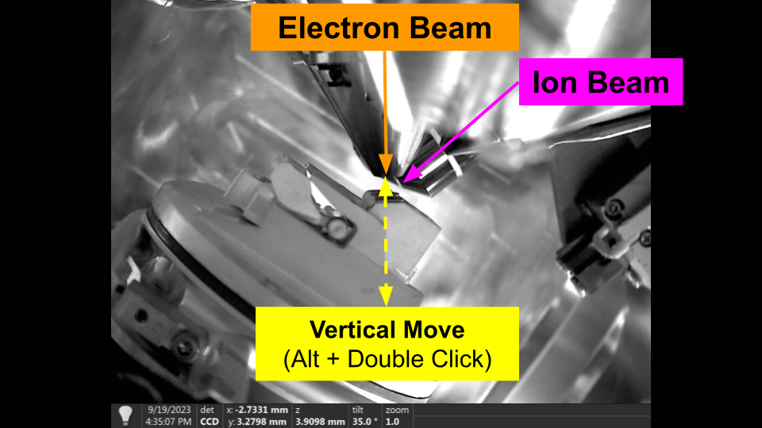
Vertical Movement - Flat to Electron

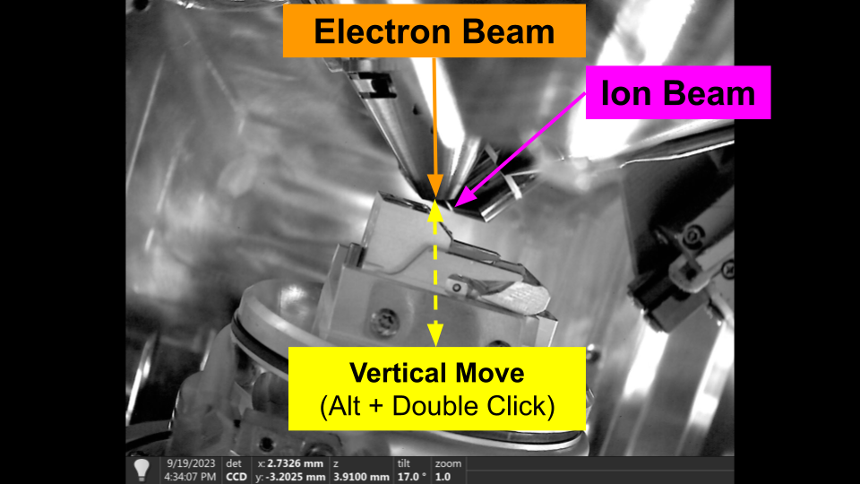
Vertical Movement - Flat to Ion


### Finding Beam Coincidence

Using stable and verical movements, we now have the basic procedure for setting the coincidence point manually in the user interface.

Assuming you have the user interface open, move the stage under the beams, and taken images with both beams:

1. Double click in the Electron Beam on the feature you would like to centre. The stage will move to centre that features. This is a stable movement.
2. Hold 'Alt' and Double click in the Ion Beam on the same feature (note: if you can't see the same feature try increasing the hfw then re-image to see if its out of view). This is a vertical move. The feature should stay centred in the Electron beam, and the feature should move to the centre of the Ion.
3. You can now double click in either beam to move the stage and the system should stay relatively coincident. There will be some small degradation depending on sample quality / consistency. 


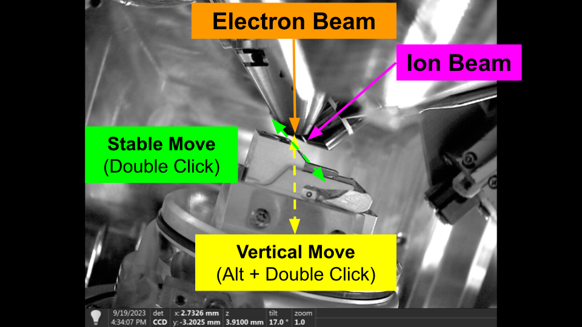
Finding Coincidence - Flat to Electron


Finding Coincidence - Flat to Ion


You can repeat this any time you lose the coincidence. We use this same procedure with automated feature detection methods to automatically restore coincidence. Please see the [Automation Section](#automation) for more information. 


## Milling

Overview

Milling Patterns

Milling Parameters

Milling Stages and Protocols

Running Milling Operations

## Manipulator

The manipulator is an insertable system use for sample manipulation and transfer. It is most commonly used for liftout workflows to transfer a region of the sample to an external landing grid. Manipulators can be needles or grippers. We currently only support needle based manipulators, such as the TFS EasyLift. 

### Axes and Coordinate Systems

Similar to the stage, the manipulator can have multiple coordinate systems. We use the Raw coordinate system to define the manipulator positions. 

#### Raw Coordinate System
TODO: draw coordinate system axes


#### Corrected Movement Axes

We also provide a corrected manipulator movement api which allows for isolated axis movements. This allows you to move each axis of the manipulator when viewing from the image perspective. That is you can move the manipulator vertically in the Ion beam without moving it in the Electron. This is particular useful for automation routines.

axis: image direction (beam) desc
x+: right (both)
y+: up (electron)
z+: up (ion)      -> moves manipulator towards the stage

TODO: draw coordinate system axes

### Manipulator Control

We provide the following methods for controlling the manipulator.

#### Insert Manipulator

To insert the manipulator

```python

# insert manipulator

from fibsem import utils, acquire
from fibsem.structures import BeamType
from matplotlib import pyplot as plt

# NOTE: recommend that you move your stage flat + down before running this script

# conect to microscope
microscope, settings = utils.setup_session()

# insert manipulator
microscope.insert_manipulator(name="PARK")

# take reference images
settings.image.hfw = 400e-6
eb_image, ib_image = acquire.take_reference_images(microscope, settings.image)

# plot
fig, ax = plt.subplots(1, 2, figsize=(10, 5))
ax[0].imshow(eb_image.data, cmap="gray")
ax[1].imshow(ib_image.data, cmap="gray")
plt.show()


```

#### Retract Manipulator

To retract the manipulator

```python

# retract manipulator
microscope.retract_manipulator()

# take reference images
settings.image.hfw = 400e-6
eb_image, ib_image = acquire.take_reference_images(microscope, settings.image)

# plot
fig, ax = plt.subplots(1, 2, figsize=(10, 5))
ax[0].imshow(eb_image.data, cmap="gray")
ax[1].imshow(ib_image.data, cmap="gray")
plt.show()


```
#### Manipulator Movement

It is recommended to use the corrected movements, as they will isolate the movements of the manipulator to in the imaging perspective. They are independent of stage tilt. 

```python
# corrected manipulator movements

# insert manipulator
microscope.insert_manipulator(name="PARK")

# take reference images
settings.image.hfw = 400e-6
eb_image, ib_image = acquire.take_reference_images(microscope, settings.image)

# plot
fig, ax = plt.subplots(1, 2, figsize=(15, 5))
plt.suptitle(f"Manipulator Inserted")
ax[0].imshow(eb_image.data, cmap="gray")
ax[1].imshow(ib_image.data, cmap="gray")
plt.show()

# move manipulator down (ION)
microscope.move_manipulator_corrected(dx=0, dy=-20e-6, beam_type=BeamType.ION)

# take reference images
settings.image.hfw = 400e-6
eb_image, ib_image = acquire.take_reference_images(microscope, settings.image)

# plot
fig, ax = plt.subplots(1, 2, figsize=(15, 5))
plt.suptitle(f"Manipulator Moved (ION)")
ax[0].imshow(eb_image.data, cmap="gray")
ax[1].imshow(ib_image.data, cmap="gray")
plt.show()

# move manipulator in x, y (ELECTRON)
microscope.move_manipulator_corrected(dx=10e-6, dy=-10e-6, beam_type=BeamType.ION)

# take reference images
settings.image.hfw = 400e-6
eb_image, ib_image = acquire.take_reference_images(microscope, settings.image)

# plot
fig, ax = plt.subplots(1, 2, figsize=(15, 5))
plt.suptitle(f"Manipulator Moved (ELECTRON)")
ax[0].imshow(eb_image.data, cmap="gray")
ax[1].imshow(ib_image.data, cmap="gray")
plt.show()

```

You can also use relative and absolute movements, but they are not recommended unless you know what you are doing. 

```python

# relative move
position = FibsemManipulatorPosition(x=10e-6, y=10e-6)
microscope.move_manipulator_relative(position)

# absolute move
position = FibsemManipulatorPosition(x=10e-6, y=10e-6)
microscope.move_manipulator_absolute(position)


```

#### Saved Positions

When calibrating the manipulator, two positions are defined, PARK and EUCENTRIC. The PARK position is high above the sample (approx ~180um) and is the default insertion position. The EUCENTRIC position
is determined when you calibrate the manipulator. It should be when the manipulator is centred in the Electron Beam, and centred vertically in the Ion Beam. This is the best way to judge depth and where the manipulator will make contact with the sample.

You can access these saved positions:

```python

# move to saved position (note: manipulator needs to be inserted beforehand)
position = microscope._get_saved_manipulator_position("PARK")
microscope.move_manipulator_absolute(position)

```

#### Offset Positions

You can also move to an offset from a named position. The offset is defined in the raw coordinates, i.e real manipulator position. The following code will insert the manipulator to 10um above the eucentric position. T  

```python
# move to offset position
from fibsem.structures import FibsemManipulatorPosition

# set position offset
position_offset = FibsemManipulatorPosition(z=10e-6, coordinate_system="RAW")

# move manipulator to offset position (z=10e-6 above EUCENTRIC)
microscope.move_manipulator_to_position_offset(position_offset, name="EUCENTRIC")

# take reference images
settings.image.hfw = 150e-6
eb_image, ib_image = acquire.take_reference_images(microscope, settings.image)

# plot
fig, ax = plt.subplots(1, 2, figsize=(15, 5))
plt.suptitle(f"Manipulator Moved To Offset")
ax[0].imshow(eb_image.data, cmap="gray")
ax[1].imshow(ib_image.data, cmap="gray")
plt.show()
```

### Manipulator Calibration

There are two supported calibration tools; ThermoFisher and TESCAN

##### Thermo Fisher EasyLift

The manipulator calibration tool assists in calibrating the EasyLift. Due to API limitations, the user still has to activate the calibration procedure in xTUI and then can follow the instructions in the tool to calibrate their EasyLift each day.

You can also run this as a script using the following:

```bash

python fibsem/tools/run_manipulator_calibration.py

```

##### TESCAN Calibration

The manipulator calibration tool will calibrate the TESCAN manipulator and map it to known coordinate systems. This allows it to follow the same convention used in the rest of the Manipulator API.

#### Manipulator Preparation

Often, liftout methods require the preparation of the manipulator before use, e.g. attaching the copper adaptor for Serial Liftout. Manipulator preparation procedures are available in AutoLamella for both the liftout and serial-liftout methods. To use the procedures, open AutoLiftout UI, connect to the microscope, create an experiment and corresponding protocol. Then the preparation procedures are availle through the Tools -> Manipulator Preparation menu. Please not that you should calibrate the manipulator before hand.  

### Manipulator Exchange

As the manipulator is used, it often becomes worn down through repeated milling or preparation. Eventually, it will become shortened and the motors will not have enough range to reach the sample. At this point, you need to exchange the manipulator. This can only be done when the system is vented, and will therefore required system downtime (especially for cryo operation). We do not currently have control over manipulator exchange, and it must be completed manually. The supported liftout method does not damage the manipulator and therefore it can be used for extended periods of time.  

## Gas Injection and Sputter Coater

Gas Injection Systems are a broad category of systems that are used for depositing material on the sample. We split these into three categories; specific deposition, cryo deposition and sputter coating.

### Specific Deposition

Specific deposition refers to using the using the beams to deposition in specific locations on the sample. A milling pattern is used to target and bake the area for deposition. 

Currently, OpenFIBSEM does not support targeted deposition (i.e. ion beam deposition). We would like to add this in the future. If you would like us to prioritise this, please get in contact, or submit a pull request. This will involve some changes to the milling api first. 

### Cryogenic Deposition

In cryogenic conditions, it is not possible to specifically deposition as the material condenses immediately. Therefore, you can only deposition in a general way (i.e. over everything). 

We support cryogenic deposition (i.e non-specific) deposition. You can also access the controls through the Cryo Deposition tool in AutoLamella (Tools -> Cryo Deposition).

Note: The system we have tested this on uses a multi-chem, so it may not work correctly for non-multichem systems. If you have a standard gis and would like to test, please contact us. 

```python

from fibsem import gis, utils

# connect to microscope
microscope, settings = utils.setup_session()

# save current position (optional)
position = microscope.get_stage_position()
position.name = "cryo-deposition-grid-01"
utils.save_positions([position])

# example cryo deposition protocol
gis_protocol = {
    "application_file": "cryo_Pt_dep",          # gis application file
    "gas": "Pt cryo",                           # gis gas
    "position": "cryo",                         # gis position 
    "hfw": 3.0e-05 ,                            # image field width
    "length": 7.0e-06,                          # pattern length
    "beam_current": 1.0e-8,                     # beam current
    "time": 30.0,                               # deposition time
}

# run cryo deposition
gis.cryo_deposition(microscope, 
                    protocol=gis_protocol, 
                    name="cryo-deposition-grid-01")     # specifying name is optional
                                                        # if not specified, current position is used

```

### Sputter Coating

Sputter coating refers to the integrated sputter coater (e.g. on the TFS Aquilos 2). It is usually a separate system than the standard GIS. 

Currently, OpenFIBSEM does not support sputter coating. We would like to add this in the future, but do not have access to a system with it. If you would like us to prioritise this, and have a system we could use to test, please get in contact.  

### Logging

OpenFISBEM uses a structured event logging format. Operations are logged using a json format and can be parsed directly from the log file. By default, logs are saved in the session directory in logfile.log. For AutoLamella applications, logs are saved inside the Experiment directory in the logfile.log.  

#### Log Parsing

AutoLamella contains a log parser for extracting statistical information from the logs, and a explorer application for analysing data. You could also use other log parsers to export this data. 

Log Parser:

```bash
autolamella/tools/data.py
```

To run the explorer app:

```bash
streamlit run autolamella/tools/stats.py
```

## Automation

### Alignment

### Image Registration

### Segmentation (Machine Learning)


We provide a standardised segmentation model interface, for loading models, running inference and visualisation.

```python


from fibsem.segmentation.model import load_model
from fibsem.segmentation.utils import plot_segmentations
from fibsem.structures import FibsemImage


# load model
model = load_model("autolamella-mega-20240107.pt")

# load image (or acquire from microscope)
image = FibsemImage.load("data/test_image.tif")

# model inference (rgb = True to auto convert to rgb)
mask = model.inference(image.data, rgb=False)
mask = mask[0]

# plot segmentation
fig = plot_segmentations(image.data, mask, alpha=0.5)


```

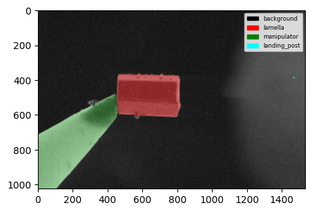


You can also plot multiple segmentations at once.

```python

from fibsem.segmentation.model import load_model
from fibsem.structures import FibsemImage
from fibsem.segmentation.utils import plot_segmentations
import glob

# load model
model = load_model("autolamella-serial-liftout-20240107.pt")

# load data
filenames = sorted(glob.glob("data/example/0*.tif"))

masks = []
images = []

for fname in filenames:
    image = FibsemImage.load(fname)

    mask = model.inference(image.data, rgb=False)
    mask = mask[0]

    masks.append(mask)
    images.append(image)

fig = plot_segmentations(images, masks, alpha=0.5)


```

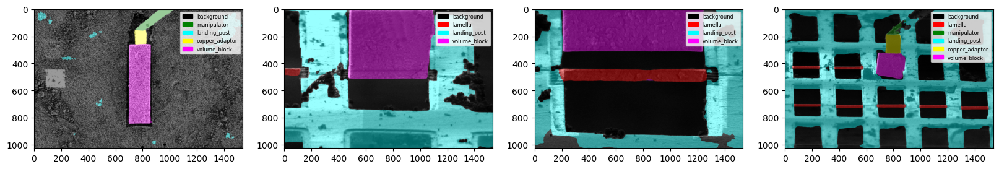


### Feature Detection

We support a standardised feature detection interface. All standardised features are implemented as an abstract base class Feature, with standard properties and interfaces (.name, .color, .detect())

```python title="fibsem/detection/detection.py"

@dataclass
class Feature(ABC):
    px: Point                 # the position of the feature in the image (pixels, image frame)
    feature_m: Point          # the position of the feature in the image (metres, microscope frame)
    color = "white"           # the display color 
    name: str = None          # the display name 
    class_id: int = None      # the class id    (ml based features only)
    class_name: str = None    # the class name  (ml based features only)

    @abstractmethod
    def detect(self, img: np.ndarray, mask: np.ndarray=None, point:Point=None) -> 'Feature':
        pass

    def to_dict(self):
        return {
            "name": self.name,
            "px": self.px.to_dict(),
            "feature_m": self.feature_m.to_dict()
        }
```

This interface allows features to implement their own detect method, which can be as simple or as complex as needs be, while allowing them to be used with all the other tools. 

```python title="fibsem/detection/detection.py"

## A simple feature for returning the centre of the image
@dataclass
class ImageCentre(Feature):
    feature_m: Point = None
    px: Point = None
    color = "white"
    name: str = "ImageCentre"

    def detect(self, img: np.ndarray, mask: np.ndarray=None, point:Point=None) -> 'ImageCentre':
        self.px = Point(x=img.shape[1] // 2, y=img.shape[0] // 2)
        return self.px


## A more complicated feature for detecting the tip of the manipulator, using a custom detect method
@dataclass
class NeedleTip(Feature):
    feature_m: Point = None
    px: Point = None
    color = "green"
    name: str = "NeedleTip"
    class_id: int = 2
    class_name: str = "manipulator"

    def detect(self, img: np.ndarray, mask: np.ndarray = None, point:Point=None) -> 'NeedleTip':
        self.px = detect_needle_v5(mask, idx=self.class_id, edge="right")
        return self.px

# detect method
def detect_needle_v5(mask: np.ndarray, idx:int=2, edge: str ="right") -> Point:
    needle_mask = mask == idx
    return detect_absolute_edge(needle_mask, edge=edge, 
        _filter="largest", _mode="median", threshold=150)

```

The list of available features is accessible here:

```python

from fibsem.detection import detection

print(detection.__FEATURES__)

```
We use the following api to detect features, and return them in a standard format. We also provide utilities for plotting. 

```python

from fibsem.detection import detection
from fibsem.segmentation.model import load_model
from fibsem.structures import FibsemImage
from fibsem.detection.detection import DetectedFeatures

# load model
model = load_model("autolamella-mega-20240107.pt")

# load image (or acquire from microscope)
image = FibsemImage.load("test_image.tif")


# detect features (also runs segmentation inference)
det: DetectedFeatures = detection.detect_features(
    image= image, 
    model= model, 
    features = features
    pixelsize = image.metadata.pixelsize
    filter = True,
    point = None
)

# plot detections
fig = detection.plot_detection(det)

```
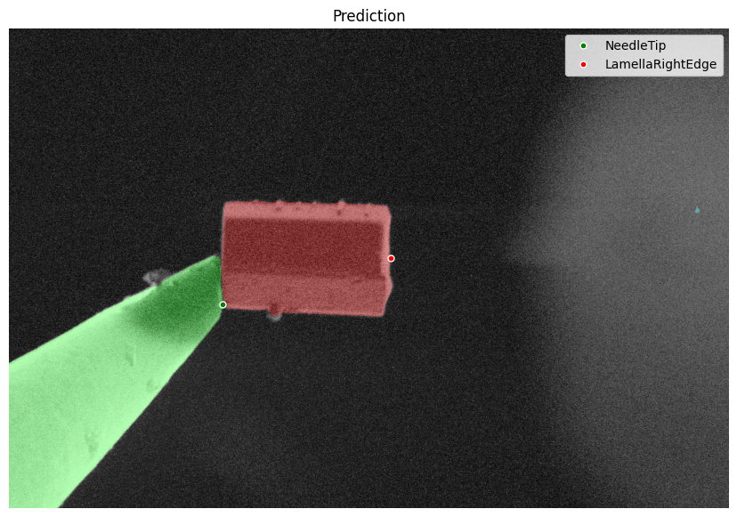
Feature Detection Example

```python title="fibsem/detection/detection.py"

@dataclass
class DetectedFeatures:
    features: list[Feature]             # list of detected features
    image: np.ndarray                   # image data
    mask: np.ndarray                    # class binary mask
    rgb: np.ndarray                     # rgb mask
    pixelsize: float                    # image pixelsize
    _distance: Point = None             # distance between the first two features
    _offset: Point = Point(0, 0)        # offset applied to distance
    fibsem_image: FibsemImage = None    # the fibsem image 
    checkpoint: str = None              # model checkpoint 

    @property
    def distance(self):
        assert len(self.features) >= 2, "Need at least two features to calculate distance"
        return self.features[0].px.distance(self.features[1].px)._to_metres(self.pixelsize) + self._offset        
        
    @distance.setter
    def distance(self, value: Point) -> None:
        self._distance = value

    def get_feature(self, ftype: Union[str, Feature]) -> Feature:
        for feature in self.features:
            if feature.name == ftype or isinstance(feature, type(ftype)):
                return feature

    def to_dict(self):
        return {
            "features": [f.to_dict() for f in self.features],
            "pixelsize": self.pixelsize,
            "offset": self._offset.to_dict(),
        }


def detect_features(
    image: Union[np.ndarray, FibsemImage],          # the image to detect features in
    model: SegmentationModel,                       # the segmentation model
    features: tuple[Feature],                       # the list of features to detect  
    pixelsize: float,                               # the pixel size of the image (used to calculate microscope coordinate conversion)
    filter: bool = True,                            # filter to the best feature, best is determined by being closest to the point. 
                                                    # false will return multiple detections each feaature
    point: Point = None                             # the point to use for the 'best' feature. defaults to the centre of the image if not specified
) -> DetectedFeatures:

    if isinstance(image, FibsemImage):
        fibsem_image = deepcopy(image)
        image = image.data
    else:
        fibsem_image = None

    # model inference
    mask = model.inference(image, rgb=False)
    rgb = model.postprocess(mask, model.num_classes)
    mask = mask[0] # remove channel dim

    # detect features
    features = detect_features_v2(img=image, 
                                  mask=mask, 
                                  features=features, 
                                  filter=filter, point=point)

    det = DetectedFeatures(
        features=features, # type: ignore
        image=image,
        mask=mask,
        rgb=rgb,
        pixelsize=pixelsize,
        fibsem_image=fibsem_image,
        checkpoint=model.checkpoint
    )

    # distance in metres (from centre)
    for feature in det.features:
        feature.feature_m = conversions.image_to_microscope_image_coordinates(
            feature.px, det.image.data, det.pixelsize
        )

    return det

```

You can also detect multiple instances of the same feature, and plot multiple detections at once.

```python
%load_ext autoreload
%autoreload 2

from fibsem.detection import detection
from fibsem.segmentation.model import load_model
from fibsem.structures import FibsemImage
from fibsem.detection.detection import DetectedFeatures, NeedleTip, LamellaRightEdge
import glob

# load model
model = load_model("autolamella-mega-20240107.pt")

# load data
filenames = glob.glob("data/example/ml*.tif")
features = [detection.LamellaCentre()]

dets = []
for fname in filenames:

    image = FibsemImage.load(fname)

    # detect features (also runs segmentation inference)
    det: DetectedFeatures = detection.detect_features(
        image= image, 
        model= model, 
        features = features,
        pixelsize = 25e-9,      # note: this should be from image.metadata.pixelsize typically
        filter=False, 
        point= None
    )

    dets.append(det)

# plot detections
detection.plot_detections(dets)

```
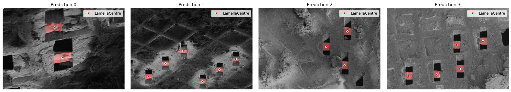

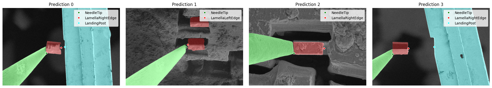

Multiple Feature Detection Examples

### Objects API

For more generic features, such a bounding boxes, instance masks, and keypoints, you can use the generic get_objects method. This returns are list of detected objects with bboxes, instance masks, and keypoints for each. 

```python

## Example: Get Objects API

from fibsem.detection import detection 
from fibsem.segmentation.model import load_model
from fibsem.structures import FibsemImage 

# load image
image = FibsemImage.load("data/test_image.tif")

# load mega model
model = load_model("autolamella-mega-20240107.pt")

# run model inference
mask = model.inference(image.data, rgb=False)
mask = mask[0]

# get all objects
objects = detection.get_objects(mask)

# plot bounding boxes
fig = detection.plot_bounding_boxes(image.data, mask, objects)

```

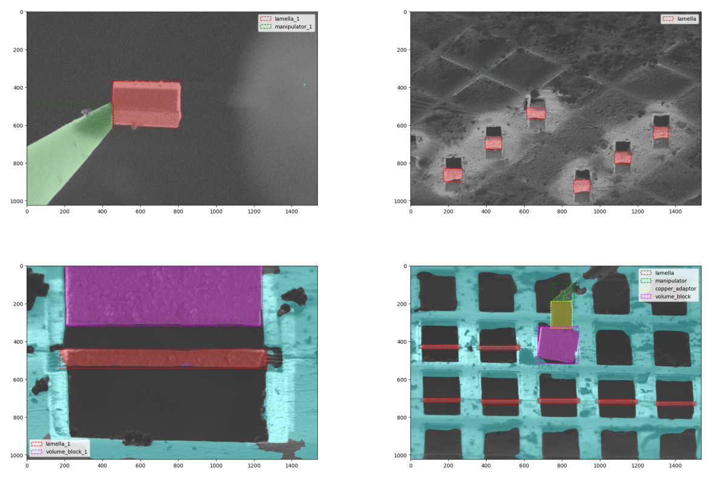
Bounding Boxes Example


## Machine Learning Data Engine

We have implemented a data engine into the AutoLamella program. This data engine enables efficient model improvement across a wide range of tasks by using human feedback, and a set of model enhanced tools. Moreover, the data engine allows the models to improve faster, and more efficiently as they improve in performance by using the models to label data and generate test sets.

[DATA ENGINE IMAGE]

### Data Collection

When running AutoLamella, we automatically save the images, masks and keypoint detections from the machine learning systems. In addition, any image can be manually added to the dataset, but will have to be manually pre-processed to conform. By default, machine learning data (images, masks, keypoints) are saved to the fibsem/log/data/ml directory.

### Data Curation

In order to efficiently improve the model, as well as automatically generate test datasets we implemented an active learning system into the user interface. When running AutoLamella in [Supervised Mode](#supervised-mode), the user has the opportunity to correct the keypoint detections produced by the model. We log this intervention, and flag that image to be added to the training dataset. Images that the model gets correct are also logged, and added to the test dataset.

This form of active learning allows us to collect images that the model is currently failing on, and not feed it any more of images that it already succeeds at. This is crucical to balance the dataset, and efficiently improve when the dataset is relative small (~100s of images).

For more details on this approach to data curation, please see [AutoLamella Datasets and Models](../autolamella/ml.md)

### Data Labelling

We developed a napari plugin for labelling images for semantic segmentation. The plugin supports three complementary labelling modes; manual labelling, model assisted labelling and sam assisted labelling.

[Image Labelling Napari Plugin]
[Example Labelling GIF for each mode]

For details about how this was used, please see [AutoLamella Datasets and Models](../autolamella/ml.md)

### Manual Labelling

The default mode is manual labelling, which enables the use the napari paint tools to manually label images. The manual labelling mode is also used to edit or 'touch up' model generated labels.

The user can define the segmentation labels and colors used by editing the fibsem/segementation/segmentation_config.yaml file.  

### Model Assisted Labelling

The model assisted labelling tool allows you to use a trained model to assist in the labelling of new data. This is useful for labelling large datasets. The model will make a prediction and the user can correct the prediction using the same drawing tools.

To use, go to the Model tab and load your model, and then tick 'model assisted' to enable the model assisted labelling.

### SegmentAnything Assisted Labelling

We have implemented the Segment Anything Model from MetaAI. This model is trained to segment any object. Here we use it as part of the model assisted labelling. We currently support the huggingface transformers implementation for SAM. You can use any compatible SAM model.

The recommended models are:

- Large GPU: facebook/sam-vit-base or facebook/sam-vit-large
- Small GPU / CPU: Zigeng/SlimSAM-uniform-50

Instructions for using SAM assisted labelling are shown in the side panel.

### Model Training

Model training is relatively simple, and by default we use models from the segmentation-models-pytorch package for the implementation.

#### Data Augmentation

Data is augmented with standard data augmentation methods that are suitable for electron microscope data.

We currently use; random rotation, random horizontal / vertical flip, random autocontrast, random equalize, gaussian blue and color jitter.

#### Losses, Optimiser

We use a standard Adam optimiser, and multi-loss (cross-entropy, dice, and focal)

#### Training the Model

To train the model:

```bash
python fibsem/segementation/train.py --config training-config.yaml
```

Example Model Training Config

```yaml title="training-config.yaml"
# data
data_paths:  [/path/to/data, /path/to/second/data]                  # paths to image data (multiple supported)
label_paths: [/path/to/data/labels, /path/to/second/data/labels]    # paths to label data (multiple supported)
save_path: /path/to/save/checkpoints                                # path to save checkpoints (checkpointed each epoch)
checkpoint: null                                                    # checkpoint to resume from

# model
encoder: "resnet34"                             # segmentation model encoder (imagenet)
num_classes: 6                                  # number of classes

# training
epochs: 50                                      # number of epochs
split: 0.1                                      # train / val split
batch_size: 4                                   # batch size
lr: 3.0e-4                                      # initial learning rate

# logging
train_log_freq: 32                              # frequency to log training images
val_log_freq: 32                                # frequency to log validation images

# wandb
wandb: true                                     # enable wandb logging
wandb_project: "autolamella-mega"               # wandb project
wandb_entity: "openfibsem"                      # wandb user / org
model_type: "mega-model"                        # model type note (descriptive only)
note: "notes about this specific training run"  # additional trianing note (descriptive only)
```

#### External Integration - NNUnet

NNUnet is a popular library for training segmentation models. We provide a set of converters for converting datasets to the nnunet format, and converting nnunet models to compatible openfibsem formats.

Script to convert data labelled with OpenFIBSEM to NNUnet format.

```bash
python scripts/convert_to_nnunet_dataset.py -h
--data_path: the path to the images directory (source)
--label_path:  the path to the labels directory (source)
--nnunet_data_path: the path to nnunet data directory (destination)
--label_map : list of label names (text file)
--filetype: the file extension of the images / labels (.tif for fibsem)
```

Script to convert nnunet trained model directory to checkpoint

```bash
python scripts/export_nnunet_checkpoint.py -h
--path: path to nnunet model directory (source)
--checkpoint_path: the path to save the output checkpoint
--checkpoint_name: the filename of the output checkpoint 
```

Make sure you save your checkpoint with 'nnunet' in the name so the load_model helper can automatically load it:

```python
from fibsem.segementation.model import load_model

# load nnunet model checkpoint
model = load_model('my-nnunet-model-checkpoint.pt')

```

#### External Integration - ONNX

ONNX (Open Neural Network Exchange) is standardised format for machine learning models. We provide a script to convert trained models to onnx format. ONNX models are much more portable, and don't require the dependency on pytorch to run.

```bash
python scripts/convert_to_onnx.py -h
--checkpoint: path to openfibsem model checkpoint
--output: path to save onnx checkpoint
```

Code to load onnx model in openfibsem

```python
from fibsem.segmentation.model import load_model

# load onnx model
model = load_model("my-model-checkpoint.onnx")
```

### Model Evaluation

### Keypoint Labelling

We provide a Keypoint Labelling Napari Plugin that can be used to label or edit keypoint labels generated by openfibsem. You can start from an empty directory of images, or load a csv containing the keypoint detections. The keypoints are used to evaluate the model as if it were being used online.

When you run AutoLamella, these keypoints used for detections are automatically logged, ready be used for evaluation.

### Keypoint Evaluation

We provide evaluation tools for evaluating the perform of a number of different models on the keypoint detection task.

The evaluation will run each model checkpoint through the detection pipeline, save the results and compare them to the ground truth labels provided. Each indivudal image can be plotted, as well as the full evaluation statistics. This evaluation pipeline is useful for checking model improvement and preventing regressions on previously successful tasks.

To run the evaluation:

```python
python fibsem/detection/run_evaluation.py --config config.yaml
```

Example Evaluation Configuration

```yaml
data_path: "path/to/data/keypoints.csv"     # test data csv (keypoints)
images_path: "path/to/data"                 # test data image directory
save_path: "path/to/results"                # save path for evaluation results

checkpoints: # list of checkpoints to evaluate
  - checkpoint: "checkpoint-01.pt"
  - checkpoint: "checkpoint-02.pt"

thresholds: # pixel thresholds for 'matched' keypoints
- 250
- 100
- 50
- 25
- 10

# options
run_eval: True          # run the evaluation
plot_eval: True         # plot the evaluation

show_det_plot: False    # show the individual keypoint detection plots
save_det_plot: True     # save the indivudial keypoint detection plots
show_eval_plot: False   # show the complete evaluation plots
save_eval_plot: True    # save the complete evaluation plots
```

### Model Deployment

We provide a number of generic segmentation model interfaces. We currently support the following model backends:
backend = "smp" (default), "nnunet", "onnx"

The load model function will automatically check which backend to use based off the name of the checkpoint. The overall generality of this model interface will be improved in the future.

Code

```python
from fibsem.segmentation.model import load_model

# load smp model
model = load_model("my-model-checkpoint.pt")

# load onnx model
model = load_model("my-model-checkpoint.onnx")

# load nnunet model
model = load_model("my-nnunet-model-checkpoint.pt")

# explictly set backend
model = load_model("my-nnunet-model-checkpoint.pt", backend="nnunet")

```

AutoLamella checkpoints are available via huggingface (patrickcleeve/autolamella), and can be selected in the protocol tab in AutoLamella. 


## User Interface

Each application has an associated user interface to allow the user to easily setup and monitor the workflow.

Applications: 

- OpenFIBSEM UI:  General FIBSEM control user interface.
- AutoLamella UI: On Grid lamella preparataion workflows
- AutoLiftout UI: Liftout based lamella preparation workflows (NB: this will be merged with AutoLamella UI in the near future)

Each user interface is implemented in napari and pyqt5. To launch the applications and plugins through napari see [napari plugins](#napari-plugins) section.


### User Interface Controls

The following standard controls are used in all applications.

#### Movement Controls

When interacting with the imaging displays, the follow controls are supported.

- Double Left Click: Move the stage to the selected position (Stable Move)
- Alt + Double Left Click: Move the stage to the selected position (Vertical Move). Only supported in Ion Beam.
- Shift + Left Click: Move the selected milling pattern to the position. Only supported in the Ion Beam.
- Ctrl + Shift + Left Click: Move all milling patterns to the position. Only supported in the Ion Beam.

#### Keypoint Controls

The following controls are supported when interacting with keypoints. 
Select Keypoint: Click on keypoint
Move Keypoint: Select and drag keypoint

### User Interface Widgets

We developed a set of ui widgets that are reused across applications.

#### System Configuration Widget

This widget allows the user to connect to the microscope, and configure the system.

#### Imaging Widget

This widget allows the user to acquire images, adjust imaging parameters and use tools (e.g. ruler).

#### Movement Widget

This widget allows the user to move the stage, and save positions.

#### Milling Widget

This widget allows the user to draw milling patterns, adjust parameters, setup milling operations and run milling.

#### Manipulator Widget

This widget allows the user to control the manipulator.

#### Feature Detection Widget

This widget allows the user to supervise the keypoint detections during a workflow, and correct them if required. 

#### Minimap Widget

This widget allows the user to use the minimap, which supports tiled imaging, low magnifcation navigation and lamella position selection. 

### User Inferface Tools

#### Cryo Deposition

You can access the cryo deposition tool via the Tools menu of AutoLamella / AutoLiftout.

#### Sputter Coating 

Not Yet Available

#### Manipulator Tools

You can access the manipulator calibration and preparation tools via the Tools menu of AutoLiftout. 

### Supervised Mode

Supervised mode can be enabled in AutoLamella. In the mode the software will pause and wait for user feedback / confirmation at specific points in the workflow. This enables the user to supervise the process, fix any mistakes, and have the software execute the rest of the workflow.  

#### Feature Detection

In supervised mode, the software will pause after making a keypoint detection, and ask the user to confirm. The user can move the keypoint to the correct position, and continue with the workflow. The updated keypoint will be used in the workflow, and the correction data will be logged for later use in the data engine (see below).

#### Milling Operations

In supervised mode, the software will pause before performing a milling operation, and ask the user to confirm the milling operations. The user can move the pattern, adjust the parameters and repeat the milling operations mulitple times. If not in supervised mode, milling operations are completed automatically.

#### Additional

In supervised mode, the software will also pause and ask for confirmation at other specific steps. For example, the when running liftout methods, the software will ask the user to confirm the lamella has made contact with the post. If they confirm, the software continues with the workflow, if not the final landing procedure is repeated until the lamella lands correctly. 

### Napari Plugins

To enable access to the user interfaces, and plugins directly through napari, please install the openfibsem napari plugin (napari-openfibsem).

```bash
pip install napari-openfibsem
```

This allows the user to access the Applications (OpenFIBSEM UI, AutoLamella UI, AutoLiftout UI) and Plugins (Imaging Labelling, Keypoint Labelling) directly through the plugin interface. 
