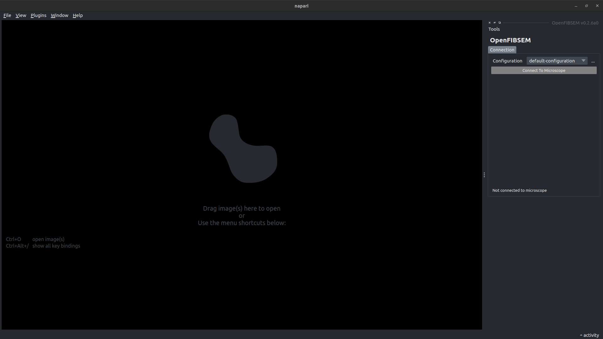
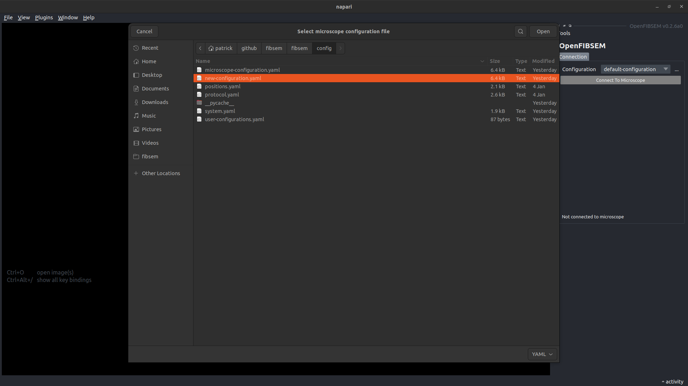
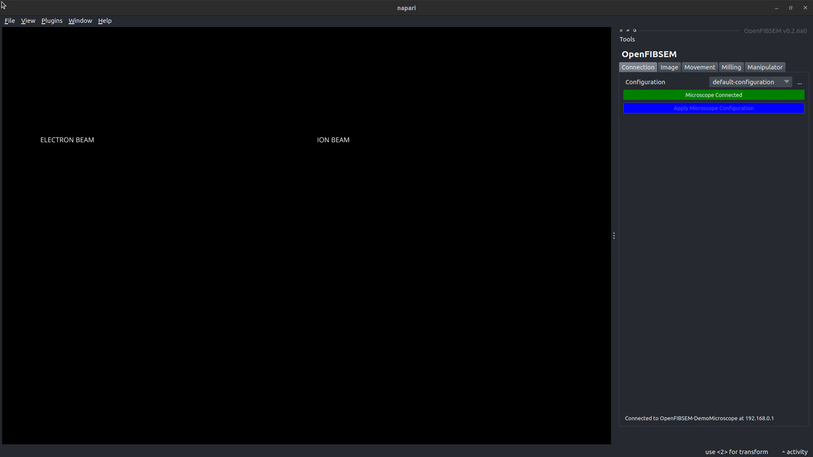
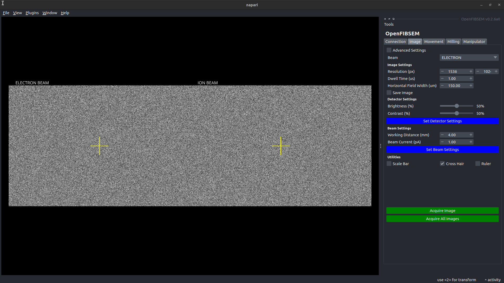

# Getting Started

## Install OpenFIBSEM

Install Package

```bash
conda create -n fibsem python=3.9 pip
conda activate fibsem
pip install fibsem 
```

### Additional Installation Information

For detailed instructions on installation, and installing the commercial microscope APIs, see [Installation Guide](installation.md).

## Configuring your Microscope

To get started you only need a few values to configure your microscope. See below for a explanation of some these values.

```yaml
name:                           monash-tfs-hydra-pfib-01    # a descriptive name for your configuration 
ip_address:                     192.168.0.1                 # the ip address of the microscope PC
manufacturer:                   Thermo                      # the microscope manufactuer, Thermo, Tescan or Demo                       
rotation-reference:             49                          # the reference rotation value (rotation when loading)  [degrees]
shuttle-pre-tilt:               35                          # the pre-tilt of the shuttle                           [degrees]
electron-beam-eucentric-height: 4.0e-3                      # the eucentric height of the electron beam             [metres]
ion-beam-eucentric-height:      16.5e-3                     # the eucentric height of the ion beam                  [metres]
```

### Generating an intial configuration

To generate an initial configuration for your microscope, run the cli:

```bash
fibsem-generate-config --path path/to/save/configuration.yaml
```

This will walk you through generating your configuration, and use derived and default values for the rest of the configuration to get you started.

You can edit the rest of the configuration values once it has been generated. The full configuration is below.

### Full Microscope Configuration

The full microscope configuration after generation is as follows. See below for an explanation of some specific values.

```yaml title="microscope-configuration.yaml"
# configuration
core:
    name: openfibsem-microscope-configuration               # a descriptive name for your configuration                     [SPECIFIED]
    ip_address: 192.168.0.1                                 # the ip address of the microscope PC                           [SPECIFIED]
    manufacturer: Thermo                                    # the microscope manufactuer                                    [SPECIFIED]        
stage:
    rotation_reference:         0                           # the reference rotation value                                  [SPECIFIED] 
    rotation_180:               180                         # the reference rotation + 180 degrees                          [DERIVED - rotation-reference]
    shuttle_pre_tilt:           35.0                        # the pre-tilt of the shuttle                                   [SPECIFIED]
    manipulator_height_limit:   0.0037                      # the linked height limit for manipulator (Thermo Only)         [DERIVED - manufactuer]
electron_beam:                                              
    column_tilt:                0                           # the column tilt of the electron beam                          [DERIVED - manufactuer]
    eucentric_height:           7.0e-3                      # the eucentric height of the electron beam                     [SPECIFIED]
    voltage:                    2000                        # the voltage of the electron beam                              [USER]
    current:                    50.0e-12                    # the current of the electron beam                              [USER]
    detector_mode:              SecondaryElectrons          # the detector mode of the electron beam                        [USER]
    detector_type:              ETD                         # the detector type of the electron beam                        [USER]
ion_beam:
    column_tilt:                52                          # the column tilt of the electron beam                          [SPECIFIED]
    eucentric_height:           16.5e-3                     # the eucentric height of the ion beam                          [SPECIFIED]
    plasma_gas:                 null                        # the plasma gas for the ion beam (plasma fib only)             [USER]
    voltage:                    30000                       # the voltage of the ion beam                                   [USER]
    current:                    2.0e-11                     # the current of the ion beam                                   [USER]
    detector_mode:              SecondaryElectrons          # the detector mode of the ion beam                             [USER]
    detector_type:              ETD                         # the detector type of the ion beam                             [USER]
imaging:
    beam_type:                  ELECTRON                    # the default imaging beam type (ELECTRON, or ION)              [USER]
    resolution:                 [1536, 1024]                # the default imaging resolution                        [pixel] [USER]
    hfw:                        150.0e-6                    # the default imaging hfw                               [metres][USER]
    dwell_time:                 1.0e-06                     # the default imaging dwell time                        [second][USER]
    imaging_current:            2.0e-11                     # the default imaging current                           [amp]   [USER]
    autocontrast:               true                        # use autocontrast                                              [USER]
    autogamma:                  false                       # use autogamma                                                 [USER]
    save:                       false                       # auto save images                                              [USER]
milling:
    milling_voltage:            30000                       # the default milling voltage       (Thermo)            [volt]  [USER]
    milling_current:            2.0e-09                     # the default milling current       (Thermo)            [amp]   [USER]   
    dwell_time:                 1.0e-06                     # the default milling dwell time    (TESCAN)            [second][USER]
    rate:                       3.4e-09                     # the default milling spuuter rate  (TESCAN)            [um3/s] [USER]
    spot_size:                  5.4e-08                     # the default milling spot size     (TESCAN)            [metres][USER]
    preset:                     "30 keV; 20 nA"             # the default milling preset        (TESCAN)                    [USER]
subsystems:
    electron:
        enabled:                true                        # electron beam is enabled                                      [USER]
    ion:        
        enabled:                true                        # ion beam is enabled                                           [USER]
        plasma:                 false                        # ion beam is a plasma column                                   [USER]
    stage:  
        enabled:                true                        # stage is enabled                                              [USER]
        rotation:               true                        # stage is able to rotate                                       [USER]
        tilt:                   true                        # stage is able to tilt                                         [USER]
    manipulator:
        enabled:                true                        # manipulator is enabled                                        [USER]
        rotation:               false                       # manipulator is able to rotate                                 [USER]
        tilt:                   false                       # manipulator is able to tilt                                   [USER]
    gis:
        enabled:                true                        # gis is enabled                                                [USER]
        multichem:              true                        # multichem is enabled                                          [USER]
        sputter_coater:         false                       # sputter coater is enabled                                     [USER]                        
```

#### IP Address

To find the local ip address of the microscope PC, you can use [ipconfig](https://learn.microsoft.com/en-us/windows-server/administration/windows-commands/ipconfig). If you have a standard setup, and have installed openfibsem on the Support PC, this ip address is usually 192.168.0.1. But this might not be the case, so check with ipconfig

#### Rotation Reference

The rotation reference is the reference point for stage rotation. For standard ThermoFisher systems it is the rotation when initially loading the stage. It is also the rotation used when you tilt perpendicular to the Electron Beam. The rotation_180 value is 180 degrees offset from the reference rotation, and is the rotation used to tilt perpendicular to the Ion Beam.

INSERT: FLAT_TO_ELECTRON_IMAGE

INSERT: FLAT_TO_ION_IMAGE

#### Column Tilt

The column tilt angle for each beam. This is standardised for each manufactuer.

| Manufacturer       | Electron Beam | Ion Beam   |
| ----------- | ----------- | -----------|
| Thermo Fisher      | 0 deg      | 52 deg    |
| Tescan | 0 deg       | 55 deg    |

#### Eucentric Height

The pre-defined working distance for each beam, that defines the eucentric point of the system. This is standard for each different model. I will add more to the table below as I confirm them.

| Model       | Electron Beam | Ion Beam   |
| ----------- | ----------- | -----------|
| TFS - Helios      | 4.0 mm       | 16.5 mm    |
| TFS - Aquilos | 7.0 mm        | 16.5 mm    |
| TESCAN - Amber |          |               |


#### Thermo Fisher Microscopes

If you are using a Thermo Fisher FIBSEM, I would recommend loading our application files; autolamella and cryo_Pt_dep. You don't have to use them, but you may need to setup application files to work with our milling conventions. 

They are found in fibsem/external/application_files. You can load them using xTUI. 

#### System Fingerprint

BETA: Not Yet Available

Connect to the microscope, read the configuration directly from it.

### Connecting to the Microscope

Once you have configured you microscope, you should be able to connect to the microscope.

#### Before You Start

Before you start it is recommended that you setup the microscope in the same way you would normally. This includes:

- Pumping the System
- Loading a Sample  
- Turning on the Beams
- Linking the Stage (Thermo Fisher)
- Anything else

We are working on controlling these aspects of the systems, but for now consider them pre-requistes for using openfibsem (and applications)

#### Try out Examples

To get familiar with the API, you can try out the [example scripts](examples.md).

#### Run the User Interface

You can run the general microscope user interface with the following command:

```bash
fibsem_ui
```

Or if you installed the napari plugin, you can launch it through the plugin menu.


OpenFIBSEM UI - Start Up

##### Select Your Configuration

From here, you can select your configuration using the "..." button. Select your configuration, add it to the user configurations, and make it the default.


OpenFIBSEM UI - Select Configuration

##### Connect to the Microscope

Once you have selected your configuration, you can connect to the microscope. From here you have full control over the microscope systems.


OpenFIBSEM UI - Microscope Connected

##### Acquire Images

Change to the Image tab, and try to take an image.


OpenFIBSEM UI - Images Acquired

### Congratulations

If you made it this far, congratulations! Your system is setup and should be ready to use. We have only scratched the surface of concepts and the api, so please check out the [Concepts](concepts.md) page to learn more about the OpenFIBSEM API, and how it can best help you.

If you have any questions feel free to reach out to Patrick on [Twitter](https://twitter.com/PatrickCleeve) or via [email](mailto:patrick@openfibsem.org).
